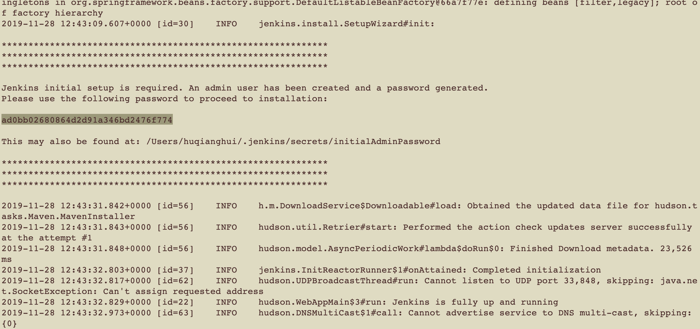
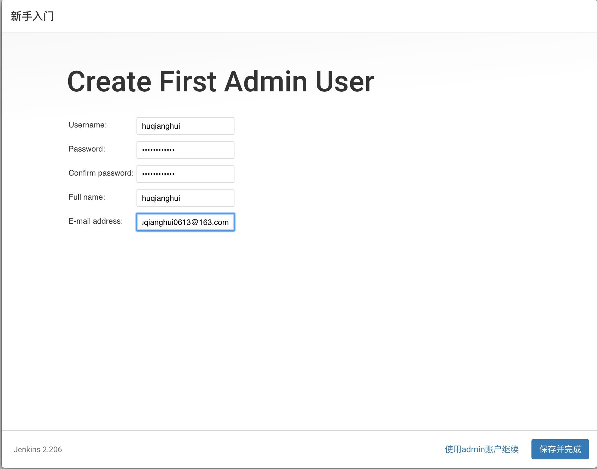
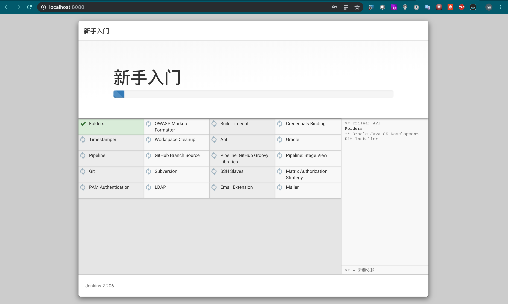
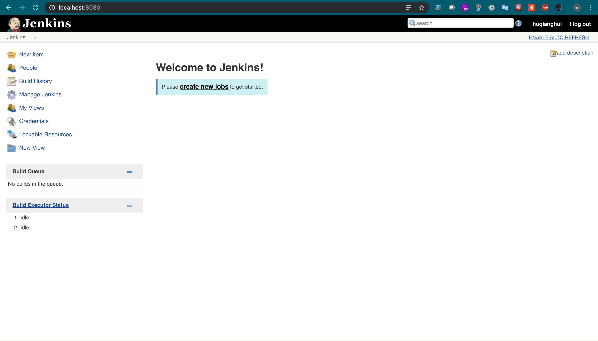
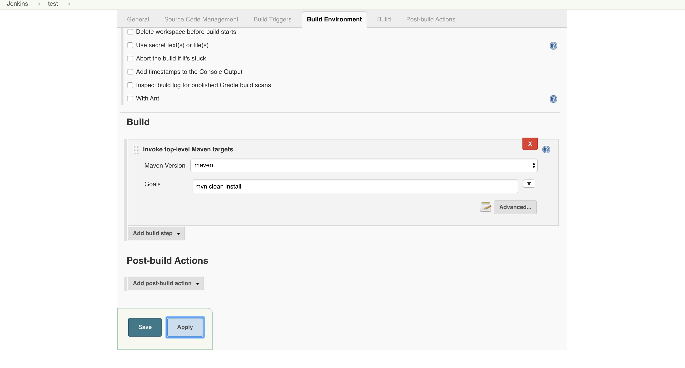
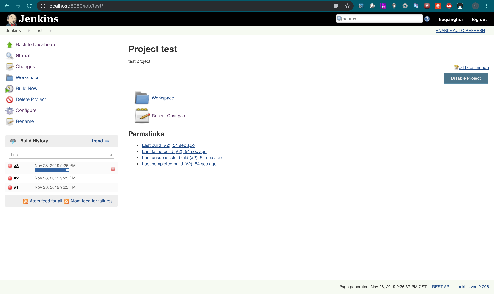
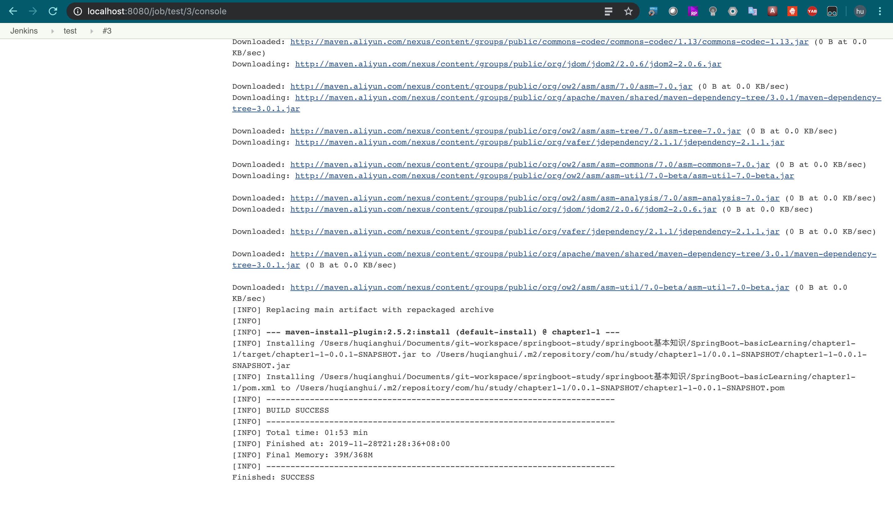
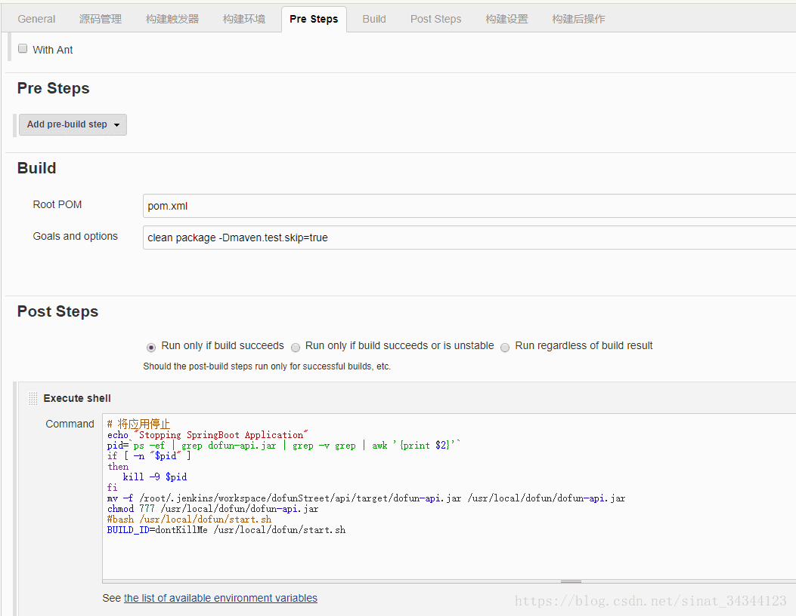

# springboot作为云原生开发服务要解决的问题

由于云服务与微服务浪潮下，springboot作为一个出色开发框架，它自身提供了哪些功能

## spring boot 与devops(CI/CD)

* jenkins 自动化部署 spring boot 项目

Jenkins 的主要目标是监控软件开发流程，快速显示问题，保证开发人员以及相关人员省时省力提高开发效率。CI 系统在整个开发过程中的主要作用是控制：当系统在代码存储库中探测到修改时，它将运行构建的任务委托给构建过程本身。如果构建失败了，那么 CI 系统将通知相关人员，然后继续监视存储库。它的角色看起来是被动的；但它确能快速反映问题。

Jenkins 特点：

1. Jenkins一切配置都可以在 web 界面上完成。有些配置如 MAVEN_HOME 和 Email，只需要配置一次，所有的项目就都能用。当然也可以通过修改 XML 进行配置。
2. 支持 Maven 的模块 (Module)，Jenkins 对 Maven 做了优化，因此它能自动识别 Module，每个 Module 可以配置成一个 job。相当灵活。
3. 测试报告聚合，所有模块的测试报告都被聚合在一起，结果一目了然，使用其他 CI，这几乎是件不可能完成的任务。
4. 构件指纹(artifact fingerprint)，每次 build 的结果构件都被很好的自动管理，无需任何配置就可以方便的浏览下载。

## 下载运行配置jenkis

通过安装war或者 brew install jenkins

重新设置Admin信息

安装需要的插件

Jenkins首页

Jenkins配置project

然后可以build project

查看build的日志和结果

可以通过post build来配置CD

## springboot应用docker镜像发布与运行

 dockerfile编写
 docker compose yaml文件编写
 docker运行

## 基于springboot的微服务框架spring cloud

spring cloud利用springboot 特性提供了微服务框架的全家桶

1. 服务发现 eureka
2. 服务配置 spring config
3. 服务路由 ribbon
4. 服务熔断与限流 hystrix
5. 服务网关 zuul
6. 服务链路监控