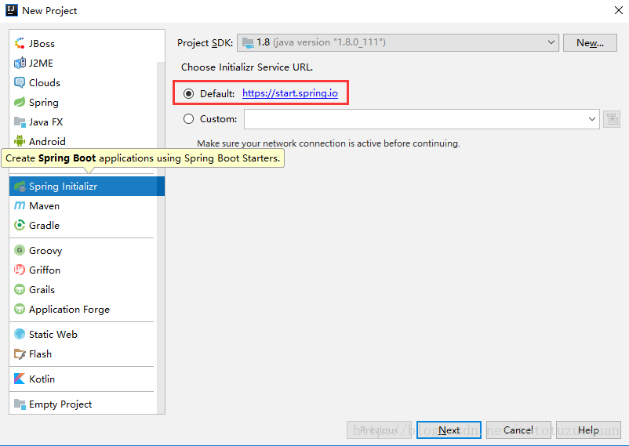

# springboot简介与quick start

通过简单的步骤搭建一个web应用程序，完成helloworld

## 本地开发环境准备

1. java8的本地安装

2. IDE的下载与安装 eclipse，sbt，intellij

3. maven的下载与配置
  
## spring的发展历史与社区

***思考问题1：与EJB相比，spring有哪些优势。为何它发展起来了。对做技术选型有哪些参考价值***

spring1.x =》 2.x => 3.x =>4.x => 5.x特性变迁

1. spring 1.x POJO的xml配置来取代EJB的复杂继承关系

2. spring 2.x 使用java5的新特性--注解，实现部分AOP功能

3. spring 3.x 启用约定优先于配置的方式，支持使用代码配置

4. spring 4.x 泛型的更好支持，脚本JVM语言groovy的引入，支持更好的部署配置

5. spring 5.x 全面Java8的增强，已经SpringWebFlux模块，响应编程的引入

## spring boot在spring基础上带来新特性

1. 嵌入式的web容器，可以快速开发一个web应用

2. 通过spring-boot-starter来组织依赖

3. autoconfig实现不同模块的自制力

4. spring-boot-cli实现groovy脚本实现更快的测试和使用

5. Spring Boot Actuator为基于Spring Boot的应用添加多个有用的管理端点

## 通过样板工程快速启动一个spring boot 工程

演示内容如下：

### 1. 快速入门

#### 1.1 快速创建的spring boot 应用工程

快速创建SpringBoot项目可以通过以下三种方式：

1) [SpringIO官网创建](https://start.spring.io/)


2）使用IDEA创建

新建Spring Initializr项目





pom文件注意点：


3） spring脚本安装


***用例请按照找./springboot-study/springboot基本知识/SpringBoot-basicLearning/chapter1-1***

#### 1.2 两种运行方式，jar 和 war，内嵌tomcat

[可执行jar](./springboot基本知识/imgs/1.2.1runExecutableJar.gif)

SpringBoo4ServletInitializer用于替代web.xml
如果你要使用外部的sevvlet容器，例如tomcat。就需要继承该类并重写configure方法。
在创建springboot项目时如果你创建的是war，则系统会默认提供一个继承类。如果创建时选择的是jar，系统不会提供这个继承！后续要改为war需要自己写这个继承。


#### 1.3 application配置文件property和yaml

Spring Boot的默认配置文件位置为： src/main/resources/application.properties。关于Spring Boot应用的配置内容都可以集中在该文件中了，根据我们引入的不同Starter模块，可以在这里定义诸如：容器端口名、数据库链接信息、日志级别等各种配置信息。比如，我们需要自定义web模块的服务端口号，可以在application.properties中添加server.port=8888来指定服务端口为8888，也可以通过spring.application.name=hello来指定应用名（该名字在Spring Cloud应用中会被注册为服务名）。

Spring Boot的配置文件除了可以使用传统的properties文件之外，还支持现在被广泛推荐使用的YAML文件。
application.yaml.yaml

```yaml
spring:
  application:
    name: Chapter13
  profiles:
    active: test
```

***用例请按照找./springboot-study/springboot基本知识/SpringBoot-basicLearning/chapter1-2***

#### 1.4 构建SpringBoot单元测试

SpringBoot提供了spring-boot-start-test启动器，该启动器提供了常见的单元测试库：
查看全部依赖关系:

mvn dependecy:tree

```text
\- org.springframework.boot:spring-boot-starter-test:jar:2.2.1.RELEASE:test
   +- org.springframework.boot:spring-boot-test:jar:2.2.1.RELEASE:test
   +- org.springframework.boot:spring-boot-test-autoconfigure:jar:2.2.1.RELEASE:test
   +- com.jayway.jsonpath:json-path:jar:2.4.0:test
   |  +- net.minidev:json-smart:jar:2.3:test
   |  |  \- net.minidev:accessors-smart:jar:1.2:test
   |  |     \- org.ow2.asm:asm:jar:5.0.4:test
   |  \- org.slf4j:slf4j-api:jar:1.7.29:compile
   +- jakarta.xml.bind:jakarta.xml.bind-api:jar:2.3.2:test
   |  \- jakarta.activation:jakarta.activation-api:jar:1.2.1:test
   +- org.junit.jupiter:junit-jupiter:jar:5.5.2:test
   |  +- org.junit.jupiter:junit-jupiter-api:jar:5.5.2:test
   |  |  +- org.opentest4j:opentest4j:jar:1.2.0:test
   |  |  \- org.junit.platform:junit-platform-commons:jar:1.5.2:test
   |  +- org.junit.jupiter:junit-jupiter-params:jar:5.5.2:test
   |  \- org.junit.jupiter:junit-jupiter-engine:jar:5.5.2:test
   +- org.junit.vintage:junit-vintage-engine:jar:5.5.2:test
   |  +- org.apiguardian:apiguardian-api:jar:1.1.0:test
   |  +- org.junit.platform:junit-platform-engine:jar:1.5.2:test
   |  \- junit:junit:jar:4.12:test
   +- org.mockito:mockito-junit-jupiter:jar:3.1.0:test
   +- org.assertj:assertj-core:jar:3.13.2:test
   +- org.hamcrest:hamcrest:jar:2.1:test
   +- org.mockito:mockito-core:jar:3.1.0:test
   |  +- net.bytebuddy:byte-buddy:jar:1.10.2:test
   |  +- net.bytebuddy:byte-buddy-agent:jar:1.10.2:test
   |  \- org.objenesis:objenesis:jar:2.6:test
   +- org.skyscreamer:jsonassert:jar:1.5.0:test
   |  \- com.vaadin.external.google:android-json:jar:0.0.20131108.vaadin1:test
   +- org.springframework:spring-core:jar:5.2.1.RELEASE:compile
   |  \- org.springframework:spring-jcl:jar:5.2.1.RELEASE:compile
   +- org.springframework:spring-test:jar:5.2.1.RELEASE:test
   \- org.xmlunit:xmlunit-core:jar:2.6.3:test
```

* JUnit： 一个Java语言的单元测试框架
* Spring Test & Spring Boot Test：为Spring Boot应用提供集成测试和工具支持
* AssertJ：支持流式断言的Java测试框架
* Hamcrest：一个匹配器库
* Mockito：一个java mock框架
* JSONassert：一个针对JSON的断言库
* JsonPath：JSON XPath库

##### SpringBoot单元测试常用注解

* @RunWith(SpringRunner.class)

JUnit运行使用Spring的测试支持。SpringRunner是SpringJUnit4ClassRunner的新名字，这样做的目的
仅仅是为了让名字看起来更简单一点。

* @SpringBootTest

该注解为SpringApplication创建上下文并支持Spring Boot特性，其webEnvironment提供如下配置：

Mock-加载WebApplicationContext并提供Mock Servlet环境，嵌入的Servlet容器不会被启动。

RANDOM_PORT-加载一个EmbeddedWebApplicationContext并提供一个真实的servlet环境。嵌入的Servlet容器将被启动并在一个随机端口上监听。

DEFINED_PORT-加载一个EmbeddedWebApplicationContext并提供一个真实的servlet环境。嵌入的Servlet容器将被启动并在一个默认的端口上监听
（application.properties配置端口或者默认端口8080）。

NONE-使用SpringApplication加载一个ApplicationContext，但是不提供任何的servlet环境。

* @MockBean

在你的ApplicationContext里为一个bean定义一个Mockito mock。

* @SpyBean

定制化Mock某些方法。使用@SpyBean除了被打过桩的函数，其它的函数都将真实返回。

* @WebMvcTest

该注解被限制为一个单一的controller，需要利用@MockBean去Mock合作者（如service）。

##### 单元测试覆盖率


查看测试用例coverage统计信息


查看测试用例coverage详细信息


#### 1.4.1 spring serivce单元测试

在spring 中设计到applicationContext，利用spring test中，把启动类给该对象，得到一个完整运行上下文

```java
@RunWith(SpringRunner.class)
@SpringBootTest(classes =Chapter11Application.class)
public class Chapter11ApplicationTests {

    @Autowired
    private HelloService helloService;

    @Test
    public void sayHello(){
        assertThat(helloService.sayHello()).isEqualTo("Hello World");
    }

}
```

测试Dao的时候，防止脏数据，以及为了重复执行可以利用rollback，在完成测试后回滚数据。

```java
@RunWith(SpringRunner.class)
@SpringBootTest
@Transactional
public class ScoreControllerTestNew {

    @Autowired
    private ModelMonitorMapper modelMonitorMapper;
    @Test
    @Rollback
    public void testDao() throws Exception {
        ModelMonitor modelMonitor = new ModelMonitor();
        modelMonitor.setModelProductId(Long.parseLong("5"));
        modelMonitor.setLogit(21.144779999999997);
        modelMonitor.setDerivedVariables("{\"debit_account_balance_code\":1.0,\"credit_consume_count\":1.0,\"debit_start_age\":1.0,\"debit_consume_sum_code\":1.0,\"age\":1.0}");
        modelMonitor.setScore("300");
        modelMonitor.setSrcData("{\"data\":{\"debit_account_balance_code\":40,\"credit_consume_count\":1,\"debit_start_age\":1,\"debit_consume_sum_code\":2,\"age\":38},\"modelProductId\":5}");
        int n = modelMonitorMapper.insert(modelMonitor);
        assertThat(n).as("检查数据是否成功插入").isEqualTo(0);
    }
}
```

#### 1.4.2 Rest service单元测试

在测试Controller时需要进行隔离测试，这个时候需要Mock Service层的服务。
可以使用MockBean，对以来对bean进行mock数据测试。

```java
package com.hu.study.chapter13;

@RunWith(SpringRunner.class)
@WebMvcTest(GoodByeController.class)
public class GoodByeControllerTests {

    @Autowired
    private MockMvc mvc;

    @MockBean
    private HelloController helloController;

    @Before
    public void setUp() {

    }

    @Test
    public void goodbyeAfterHello() throws Exception {
        given(this.helloController.sayHello()).willReturn("hello test.");
        mvc.perform(MockMvcRequestBuilders.get("/goodbye").accept(MediaType.APPLICATION_JSON))
                .andExpect(status().isOk())
                .andExpect(content().string(equalTo("hello test. goodbye.")));
    }

}
```

***用例请按照找./springboot-study/springboot基本知识/SpringBoot-basicLearning/chapter1-3***

### 1.5 参考网站

https://start.spring.io/

https://spring.io/

https://github.com/spring-projects/spring-boot

https://docs.spring.io/spring-boot/docs/current/reference/html/

https://spring.io/projects/spring-boot#overview

<table>
<tr><td>HTTP方法</td><td>路径</td><td>描述</td><td>鉴权</td></tr>
<tr><td>GET</td><td>/autoconfig</td><td>查看自动配置的使用情况</td><td>true</td></tr>
<tr><td>GET</td><td>/configprops</td><td>查看配置属性，包括默认配置</td><td>true</td></tr>
<tr><td>GET</td><td>/beans</td><td>查看bean及其关系列表</td><td>true</td></tr>
<tr><td>GET</td><td>/dump</td><td>打印线程栈</td><td>true</td></tr>
<tr><td>GET</td><td>/env</td><td>查看所有环境变量</td><td>true</td></tr>
<tr><td>GET</td><td>/env/{name}</td><td>查看具体变量值</td><td>true</td></tr>
<tr><td>GET</td><td>/health</td><td>查看应用健康指标</td><td>false</td></tr>
<tr><td>GET</td><td>/info</td><td>查看应用信息</td><td>false</td></tr>
<tr><td>GET</td><td>/mappings</td><td>查看所有url映射</td><td>true</td></tr>
<tr><td>GET</td><td>/metrics</td><td>查看应用基本指标</td><td>true</td></tr>
<tr><td>GET</td><td>/metrics/{name}</td><td>查看具体指标</td><td>true</td></tr>
<tr><td>POST</td><td>/shutdown</td><td>关闭应用</td><td>true</td></tr>
<tr><td>GET</td><td>/trace</td><td>查看基本追踪信息</td><td>true</td></tr>
</table>

### 1.6 banner的客户化

```text
${AnsiColor.BRIGHT_YELLOW}
										//                          _ooOoo_                               //
										//                         o8888888o                              //
										//                         88" . "88                              //
										//                         (| ^_^ |)                              //
										//                         O\  =  /O                              //
										//                      ____/`---'\____                           //
										//                    .'  \\|     |//  `.                         //
										//                   /  \\|||  :  |||//  \                        //
										//                  /  _||||| -:- |||||-  \                       //
										//                  |   | \\\  -  /// |   |                       //
										//                  | \_|  ''\---/''  |   |                       //
										//                  \  .-\__  `-`  ___/-. /                       //
										//                ___`. .'  /--.--\  `. . ___                     //
										//              ."" '<  `.___\_<|>_/___.'  >'"".                  //
										//            | | :  `- \`.;`\ _ /`;.`/ - ` : | |                 //
										//            \  \ `-.   \_ __\ /__ _/   .-` /  /                 //
										//      ========`-.____`-.___\_____/___.-`____.-'========         //
										//                           `=---='                              //
										//      ^^^^^^^^^^^^^^^^^^^^^^^^^^^^^^^^^^^^^^^^^^^^^^^^^^        //
										//             佛祖保佑          永无BUG         永不修改            //
										////////////////////////////////////////////////////////////////////
```

https://devops.datenkollektiv.de/create-your-own-spring-boot-banner.html

https://medium.com/cloud-native-the-gathering/

how-to-customize-and-add-color-to-your-spring-boot-banners-to-look-awesome-4654d58fe490

***用例请按照找./springboot-study/springboot基本知识/SpringBoot-basicLearning/chapter1-3***

## 2. web应用文档以及前后端分离的合作方式

### 为什么要实现API文档化

* API文档化有利于前后端分离的开展。随着开发方式全面转成前后端分离，前端和后端的唯一沟通就在API层面。在没有文档化之前，开发人员只能口头的交代并反复理解每个接口参数和返回值，这个过程相当不稳定，变化频繁。而通过API文档化后，可以通过文档的清晰定义，使得前后端人员减少无畏沟通，并在理解上保持一致；

* API文档化有利于接口自动化测试。公司马上上马接口自动化测试，对接口参数和返回值要通过Json方式导入自动化测试程序。而用特殊工具生成的API文档，可以直接输出json格式的文档，简化了测试流程，减轻了开发人员的工作量；

* API文档化有利于系统文档建设。开发人员不愿意写文档，写注释。而为了以上两个目的必须要求开发人员在编码的同时补充相关的API描述，而通过一个相对稳定成熟和趁手的工具可以大大减轻文档的工作量，做到事半功倍。

### API文档化标准--swagger

swagger是一个流行的API开发框架，这个框架以“开放API声明”（OpenAPI Specification，OAS）为基础，
对整个API的开发周期都提供了相应的解决方案，是一个非常庞大的项目（包括设计、编码和测试）。

Swagger 是一个规范和完整的框架，用于生成、描述、调用和可视化 RESTful 风格的 Web 服务。
总体目标是使客户端和文件系统作为服务器以同样的速度来更新。
文件的方法，参数和模型紧密集成到服务器端的代码，允许API来始终保持同步。Swagger 让部署管理和使用功能强大的API从未如此简单。

### swagger的spring技术范围内的实现者--spring fox

在spring boot中spring-fox Swagger会自动根据我们的接口来生成一个html页面，在这个页面上我们可以看到所有接口信息，信息中包含了有哪些参数，每个参数代表什么意思，如果是一个带body体的请求，还会自动帮我们生成json格式的bogy。并且还可以像http请求工具那样进行接口请求。

swagger的作用

* 对Spring的RestController、Controller接口进行包装,封装输出为Swagger规范中的path
* 针对Rest接口涉及到的model进行解析,包括model的属性等
* 满足文档分组的要求,解析tags

***总结一句话就是：输出符合Swagger API规范的JSON格式**


### spring boot生态的实现方式spring-boot-starter-swagger

通过简单starter引入，解决一系列自动配置的问题。

### 2.1 使用spring fox 来生成Swagger规范的API文档

Swagger注解说明：

* @Api(value = “用户Controller”)

    加在controller类上

    value表示该类的描述

* @ApiOperation(value = “获取用户信息”, notes = “通过id获取用户”)

    加在相应的请求处理方法上

    value表示该方法的说明

    note相当于对该方法的详细说明，也就是更加完整的描述

* @ApiParam(value = “用户ID”)

    加在请求方法的普通参数上

    value的值是对该参数的说明

    需要注意的是，@RequestParam注解不能省略，否则Swagger会当做body进行解析。

* @ApiModel(value = “用户信息”)

    加在请求方法的请求对象的类上

    例如有一个请求方法saveUser(User user), 则需要加在User这个类上面(可以参照下面的示例)

* @ApiModelProperty(value = “用户ID”, example = “1”)

    加在请求方法的参数对象的属性上

    value 对该属性的描述

    example 代表swagger文档中自动生成的json的默认值

* @ApiImplicitParams(value = {})

    用在请求方法上

    这个注解必须和下面的@ApiImplicitParam配合使用

    当请求方法中的请求参数很多的时候，例如saveUser(String username, Integer age, Date birthday, String phone),这个时候我们如果还是使用
    @ApiParam会让方法体变的非常乱。

* @ApiImplicitParam(name = “id”, paramType = “path”, value = “用户ID”)

    用在@ApiImplicitParams的value中

    name 参数中属性的名字

    paramType 这个参数必须指定，代表参数的传输类型，有五个取值：path(url参数),query(请求参数), body(请求体参数)，header(头部参数)，form(表单参数)。

    value 对这个属性的描述

    再此强调一下，paramType不能少

* sample code

```java
@RestController
@RequestMapping(value = "/user")
public class UserController {

    @ApiOperation(value = "获取用户信息", notes = "通过id获取用户")
    @GetMapping(value = "/{id}")
    @ApiImplicitParams(value = {
            @ApiImplicitParam(name = "id", paramType = "path", value = "用户ID"),
            @ApiImplicitParam(name = "username", paramType = "query", value = "用户名")
    })
    public ApiResult getUser(@PathVariable(value = "id") Integer id, @RequestParam String username) {
        return ApiResult.success(new UserDTO(id, username, LocalDateTime.now()));
    }

    @ApiOperation(value = "保存用户", notes = "保存用户，ID为后台自动生成")
    @PostMapping
    public ApiResult saveUser(@RequestBody UserDTO userDTO) {
        return ApiResult.success(userDTO);
    }

    @ApiOperation(value = "更新用户", notes = "更新用户，ID必传")
    @PutMapping
    public ApiResult updateUser(@RequestBody UserDTO userDTO) {
        return ApiResult.success("success");
    }

    @DeleteMapping("/{id}")
    public ApiResult removeUser(@ApiParam(value = "用户ID") @PathVariable(value = "id")  Integer id,
                                @ApiParam(value = "用户名") @RequestParam String username) {
        return ApiResult.success("success");
    }

}
```

* 启动日志提示：


* 页面显示：


[Swagger说明文档](https://github.com/qct/swagger-example/blob/master/README.zh-CN.md)

***用例请按照找./springboot-study/springboot基本知识/SpringBoot-basicLearning/chapter2-1***

#### 2.2 JSR-303实现请求参数校验，来进一步完善API的规范数据

ApiImplicitParams里面对基本类型参数可以通过require，type等来校验限制。Bean的校验需要结合JSR-303来进一步规划。
对外提供API文档，对于数据的规范也要提供进一步指导。
请求参数的校验是很多新手开发非常容易犯错，或存在较多改进点的常见场景。比较常见的问题主要表现在以下几个方面：

* 仅依靠前端框架解决参数校验，缺失服务端的校验。这种情况常见于需要同时开发前后端的时候，虽然程序的正常使用不会有问题，但是开发者忽略了非正常操作。比如绕过前端程序，直接模拟客户端请求，这时候就会突然在前端预设的各种限制，直击各种数据访问接口，使得我们的系统存在安全隐患。

* 大量地使用if/else语句嵌套实现，校验逻辑晦涩难通，不利于长期维护。

* 文档要统一提早规范。
  
所以，针对上面的问题，建议服务端开发在实现接口的时候，对于请求参数必须要有服务端校验以保障数据安全与稳定的系统运行。同时，对于参数的校验实现需要足够优雅，要满足逻辑易读、易维护的基本特点。

**JSR-303**
在开始动手实践之前，我们先了解一下接下来我们将使用的一项标准规范：JSR-303

**什么是JSR？**
JSR是Java Specification Requests的缩写，意思是Java 规范提案。是指向JCP(Java Community Process)提出新增一个标准化技术规范的正式请求。任何人都可以提交JSR，以向Java平台增添新的API和服务。JSR已成为Java界的一个重要标准。

JSR-303定义的是什么标准？

JSR-303 是JAVA EE 6 中的一项子规范，叫做Bean Validation，Hibernate Validator 是 Bean Validation 的参考实现 . Hibernate Validator 提供了 JSR 303 规范中所有内置 constraint 的实现，除此之外还有一些附加的 constraint。

Bean Validation中内置的constraint


Hibernate Validator附加的constraint


在JSR-303的标准之下，我们可以通过上面这些注解，优雅的定义各个请求参数的校验。

模型代码：

```java
@Data
@ApiModel(description = "用户实体")
public class User {

    @ApiModelProperty("用户编号")
    private Long id;

    @NotNull
    @Size(min = 2, max = 5)
    @ApiModelProperty("用户姓名")
    private String name;

    @NotNull
    @Max(100)
    @Min(10)
    @ApiModelProperty("用户年龄")
    private Integer age;

    @NotNull
    @Email
    @ApiModelProperty("用户邮箱")
    private String email;
}
```

请求代码样例(@Valid)：

```java
@PostMapping("/")
    @ApiOperation(value = "创建用户", notes = "根据User对象创建用户")
    public String postUser(@Valid @RequestBody User user) {
        users.put(user.getId(), user);
        return "success";
    }


@GetMapping("/byIdOrName")
@ApiOperation(value = "通过ID或者名字获取单个用户信息")
@ApiImplicitParams({
        @ApiImplicitParam(paramType = "query",name = "userId",value = "用户ID",dataType = "Long",required = false),
        @ApiImplicitParam(paramType = "query",name = "name",value = "用户名",dataType = "String",required = false)}
)
public User getUserByIdOrName(Long userId,String name) {
    Assert.that(userId !=null || name != null,"The parameters cannot be null at the same time.");
    List<User> r = new ArrayList<>(users.values());
    return r.stream().filter(user -> user.getId().equals(userId) || user.getName().equals(name)).findFirst().orElse(null);
}

@GetMapping("/byIdAndName")
@ApiOperation(value = "通过ID或者名字获取单个用户信息")
@ApiImplicitParams({
        @ApiImplicitParam(paramType = "query",name = "userId",value = "用户ID",dataType = "Long",required = true),
        @ApiImplicitParam(paramType = "query",name = "name",value = "用户名",dataType = "String",required = true)}
)
public User getUserByIdAndName(Long userId,String name) {
    List<User> r = new ArrayList<>(users.values());
    return r.stream().filter(user -> user.getId().equals(userId) || user.getName().equals(name)).findFirst().orElse(null);
}
```

模型的validation信息：


模型校验结果：


模型的UI require显示：


模型的基本类型校验：


***用例请按照找./springboot-study/springboot基本知识/SpringBoot-basicLearning/chapter2-2***

#### 2.3 swagger接口管理

有三种方法可以编辑swagger文件：在线编辑，本地搭建编辑，文本编辑器编辑Visual studio code

* 在线编辑swagger文件

从rest api导出的是json数据格式，需要编辑的话，可以通过swagger editor转成yaml文件
可以online 编辑swagger文件


* 本地搭建

1. 首先通过npm 安装swagger(npm install -g swagger):


2. 创建一个swagger的项目,启动server编辑


3. 文本编辑器编辑


***用例请按照找./springboot-study/springboot基本知识/SpringBoot-basicLearning/chapter2-2***

#### 2.4 swagger的json 数据来利用nodeJs 和 swagger tools完成mocker server

本身使用swagger editor本身就可以生成不同技术栈的server，但是对前端来讲对容易理解的还是nodejs。
如下是swagger editor的server 支持列表：


swagger-tools
swagger-tools里的工具也是以这个swagger.json作为入口的。他提供了很多中间件，可以来帮助我们搭建一个Mock Server。

```javascript
// 使用swagger-tools和connect引入各种中间件代码的示例
const app = require('connect')();
const http = require('http');
const swaggerTools = require('swagger-tools');

let serverPort = 3001;

let options = {
  useStubs: true // turn on stubs (mock mode)
};

// The Swagger document (require it, build it programmatically, fetch it from a URL, ...)
let swaggerDoc = require('./swagger.json');

// Initialize the Swagger middleware
swaggerTools.initializeMiddleware(swaggerDoc, function (middleware) {
  // Interpret Swagger resources and attach metadata to request - must be first in swagger-tools middleware chain
  app.use(middleware.swaggerMetadata());

  // Validate Swagger requests
  app.use(middleware.swaggerValidator());

  // Route validated requests to appropriate controller
  app.use(middleware.swaggerRouter(options));

  // Serve the Swagger documents and Swagger UI
  app.use(middleware.swaggerUi());

  // Start the server
  http.createServer(app).listen(serverPort, function () {
    console.log('Your server is listening on port %d (http://localhost:%d)', serverPort, serverPort);
  });
});
```

我们发现在这里我们自己起了一个node app，这个node app提供访问文档的在线接口localhost:3001/docs，同时你可以访问Mock Server的各种API接口，他会返回模拟的数据，这里也能在在线文档那里可视化地request这些接口。不过模拟的数据总是一些固定的死数据，没有mock.js库提供的模拟数据那么丰富的变化。

这里提供一种可行的解决方案，后端在自己的Restful API Server主程序中，将npm run apidoc生成的swagger.json放到/dist/public/文件夹下，暴露给Mock Server获取，Mock Server里面动态地从Server主程序中去拿到swagger.json然后再生成Mock Server以及能在线查看的文档等等。这样一来，以后当Restful API Server的某个接口有变动，则后端程序员只需要在更改完接口的逻辑之后，将接口注释也改了，然后npm run apidoc重新生成一份swagger.json文件，Mock Server那边完全不用改，前端上Mock Server时就能看到更新的文档了。

这种解决方案是我目前想到的最方便的方案之一，同时文档、Mock数据的功能提供也和主业务逻辑的代码分离开在两个node app里了，二者唯一的关联则是Mock Server发起网络去请求API Server的swagger.json文件。也是符合关注点分离的思想之一的解决方案，唯一的缺点在于，生成的假数据没有办法像mock.js那么优雅，但是我觉得前端其实更看重的是返回的数据结构，至于数据本身是什么，可能就是美观度的问题而已。

其他还有Mock Server和easy-mock 框架等等，大家可以去尝试。

#### 2.5 API在文件中的分组与排序

接口的分组

Spring Boot中定义各个接口是以Controller作为第一级维度来进行组织的，Controller与具体接口之间的关系是一对多的关系。

我们可以将同属一个模块的接口定义在一个Controller里。

默认情况下，Swagger是以Controller为单位，对接口进行分组管理的。

这个分组的元素在Swagger中称为Tag，但是这里的Tag与接口的关系并不是一对多的，它支持更丰富的多对多关系。

代码中@Api定义的tags内容替代了默认

```java
@Api(tags = {"1-教师管理","3-教学管理"})
    @RestController
    @RequestMapping(value = "/teacher")
    static class TeacherController {

        @ApiOperation(value = "xxx")
        @GetMapping("/xxx")
        public String xxx() {
            return "xxx";
        }

    }
```

更细粒度的接口分组

通过@Api可以实现将Controller中的接口合并到一个Tag中

以通过使用@ApiOperation注解中的tags属性做更细粒度的接口分类定义

```java
@ApiOperation(value = "获取学生清单", tags = "教学管理")
    @GetMapping("/list")
    public String bbb() {
        return "bbb";
    }
```

内容的顺序
在完成了接口分组之后，对于接口内容的展现顺序又是众多用户特别关注的点，其中主要涉及三个方面：分组的排序、接口的排序以及参数的排序，下面我们就来逐个说说如何配置与使用。

配置代码如下：

```java
@Bean
    public UiConfiguration uiConfiguration(SwaggerProperties swaggerProperties) {
        return UiConfigurationBuilder.builder()
                .deepLinking(swaggerProperties.getUiConfig().getDeepLinking())
                .defaultModelExpandDepth(swaggerProperties.getUiConfig().getDefaultModelExpandDepth())
                .defaultModelRendering(swaggerProperties.getUiConfig().getDefaultModelRendering())
                .defaultModelsExpandDepth(swaggerProperties.getUiConfig().getDefaultModelsExpandDepth())
                .displayOperationId(swaggerProperties.getUiConfig().getDisplayOperationId())
                .displayRequestDuration(swaggerProperties.getUiConfig().getDisplayRequestDuration())
                .docExpansion(swaggerProperties.getUiConfig().getDocExpansion())
                .maxDisplayedTags(swaggerProperties.getUiConfig().getMaxDisplayedTags())
                .operationsSorter(swaggerProperties.getUiConfig().getOperationsSorter())
                .showExtensions(swaggerProperties.getUiConfig().getShowExtensions())
                .tagsSorter(swaggerProperties.getUiConfig().getTagsSorter())
                .validatorUrl(swaggerProperties.getUiConfig().getValidatorUrl())
                .build();
    }
```

***分组的排序(tagsSorter)***

关于分组排序，也就是Tag的排序。目前版本的Swagger支持并不太好，通过文档我们可以找到关于Tag排序的配置方法。
用户通过修改配置的方式：

swagger.ui-config.tags-sorter=alpha

***接口的排序(operationsSorter)***

在完成了分组排序问题（虽然不太优雅…）之后，在来看看同一分组内各个接口该如何实现排序

同样Swagger Starter用户，可以通过修改配置的方式：

swagger.ui-config.operations-sorter=alpha

参数的排序(position)
完成了接口的排序之后，更细粒度的就是请求参数的排序了。默认情况下，Swagger对Model参数内容的展现也是按字母顺序排列的。所以之前教程中的User对象在文章中展现如下：

```java
@Data
@ApiModel(description = "用户实体")
public class User {
    @ApiModelProperty(value = "用户编号", position = 1)
    private Long id;
    @NotNull
    @Size(min = 2, max = 5)
    @ApiModelProperty(value = "用户姓名", position = 2)
    private String name;
    @NotNull
    @Max(100)
    @Min(10)
    @ApiModelProperty(value = "用户年龄", position = 3)
    private Integer age;
    @NotNull
    @Email
    @ApiModelProperty(value = "用户邮箱", position = 4)
    private String email;
}
```

***用例请按照找./springboot-study/springboot基本知识/SpringBoot-basicLearning/chapter2-3***

#### 2.6 静态文档的生成

swagger我们已经不陌生了，另外可以借助于swagger-ui，可以实现动态的、可测试的API文档。

本文主要介绍如何使用swagger2markup生成静态的HTML及PDF文档。

Swagger2Markup是Github上的一个开源项目。该项目主要用来将Swagger自动生成的文档转换成几种流行的格式以便于静态部署和使用，比如：AsciiDoc、Markdown、Confluence。

##### 生成 AsciiDoc 文档

***通过Java代码来生成***

pom文件中增加依赖，通过测试方法来生成

```text
<dependencies>
    ...

    <dependency>
        <groupId>io.github.swagger2markup</groupId>
        <artifactId>swagger2markup</artifactId>
        <version>1.3.3</version>
        <scope>test</scope>
    </dependency>
</dependencies>

<repositories>
    <repository>
        <snapshots>
            <enabled>false</enabled>
        </snapshots>
        <id>jcenter-releases</id>
        <name>jcenter</name>
        <url>http://jcenter.bintray.com</url>
    </repository>
</repositories>
```

测试代码：

```java
@RunWith(SpringRunner.class)
@SpringBootTest(webEnvironment = SpringBootTest.WebEnvironment.DEFINED_PORT)
public class DemoApplicationTests {

    @Test
    public void generateAsciiDocs() throws Exception {

        URL remoteSwaggerFile = new URL("http://localhost:8080/v2/api-docs");
        Path outputDirectory = Paths.get("src/docs/asciidoc/generated");

        //    输出Ascii格式
        Swagger2MarkupConfig config = new Swagger2MarkupConfigBuilder()
                .withMarkupLanguage(MarkupLanguage.ASCIIDOC)
                .build();


        Swagger2MarkupConverter.from(remoteSwaggerFile)
                .withConfig(config)
                .build()
                .toFolder(outputDirectory);
    }

}
```

代码说明：

* MarkupLanguage.ASCIIDOC：指定了要输出的最终格式。除了ASCIIDOC之外，还有MARKDOWN和CONFLUENCE_MARKUP，分别定义了其他格式，后面会具体举例。

* from(remoteSwaggerFile：指定了生成静态部署文档的源头配置，可以是这样的URL形式，也可以是符合Swagger规范的String类型或者从文件中读取的流。如果是对当前使用的Swagger项目，我们通过使用访问本地Swagger接口的方式，如果是从外部获取的Swagger文档配置文件，就可以通过字符串或读文件的方式

* toFolder(outputDirectory)：指定最终生成文件的具体目录位置

***输出到单个文件***

如果不想分割结果文件，也可以通过替换toFolder(Paths.get("src/docs/asciidoc/generated")为toFile(Paths.get("src/docs/asciidoc/generated/all"))，将转换结果输出到一个单一的文件中，这样可以最终生成html的也是单一的。

***通过 Maven 插件来生成***
swagger2markup还提供了对应的Maven插件来使用。对于上面的生成方式，完全可以通过在pom.xml中增加如下插件来完成静态内容的生成。

```text
<plugin>
    <groupId>io.github.swagger2markup</groupId>
    <artifactId>swagger2markup-maven-plugin</artifactId>
    <version>1.3.3</version>
    <configuration>
        <swaggerInput>http://localhost:8080/v2/api-docs</swaggerInput>
        <outputDir>src/docs/asciidoc/generated-by-plugin</outputDir>
        <config>
            <swagger2markup.markupLanguage>ASCIIDOC</swagger2markup.markupLanguage>
        </config>
    </configuration>
</plugin>
```

在使用插件生成前，需要先启动应用。然后执行插件，就可以在src/docs/asciidoc/generated-by-plugin目录下看到也生成了上面一样的adoc文件了.

***生成HTML***
在完成了从Swagger文档配置文件到AsciiDoc的源文件转换之后，就是如何将AsciiDoc转换成可部署的HTML内容了。这里继续在上面的工程基础上，引入一个Maven插件来完成。

```text
<plugin>
    <groupId>org.asciidoctor</groupId>
    <artifactId>asciidoctor-maven-plugin</artifactId>
    <version>1.5.6</version>
    <configuration>
   	    <sourceDirectory>src/docs/asciidoc/generated</sourceDirectory>
   	    <outputDirectory>src/docs/asciidoc/html</outputDirectory>
   	    <backend>html</backend>
   	    <sourceHighlighter>coderay</sourceHighlighter>
   	    <attributes>
            <toc>left</toc>
  	    </attributes>
  	</configuration>
</plugin>
```

通过上面的配置，执行该插件的asciidoctor:process-asciidoc命令之后，就能在src/docs/asciidoc/html目录下生成最终可用的静态部署HTML了。在完成生成之后，可以直接通过浏览器来看查看.

###### Markdown 与 Confluence 的支持

要生成Markdown和Confluence的方式非常简单，与上一篇中的方法类似，只需要修改一个参数即可。

```java
//    输出markdown格式
Swagger2MarkupConfig config = new Swagger2MarkupConfigBuilder()
    .withMarkupLanguage(MarkupLanguage.MARKDOWN)
    .build();

// OR

// conflunece
Swagger2MarkupConfig config = new Swagger2MarkupConfigBuilder()
    .withMarkupLanguage(MarkupLanguage.CONFLUENCE_MARKUP)
    .build();
```

运行之后分别在markdown和confluence目录下输出了不同格式的转换内容。

***如果想要通过插件来生成，直接参考上一节内容，只需要修改插件配置中的swagger2markup.markupLanguage即可支持输出其他格式内容。***

* Markdown的部署
  
git或者git lab等工具都可以使用。

* Confluence的部署
  
如果团队中使用Confluence作为文档管理系统都话，可以把生成文件导入到这个系统中去。


实现方式：


***用例请按照找./springboot-study/springboot基本知识/SpringBoot-basicLearning/chapter2-4***

#### 2.7 postman 使用

后端人员的测试工具，如果不使用swagger UI的情况下。


#### 2.8 参考网站

https://swagger.io/

https://editor.swagger.io/

https://github.com/swagger-api

https://github.com/Swagger2Markup/swagger2markup