# springboot开发过程的高级主题

## 1.spring autoconfiguration

### 1.1 XML Configuration VS. JavaConfig

Java SE5扩展了反射机制的API，以帮助程序员快速的构造自定义注解处理器.
Annotation的知识图谱如下：
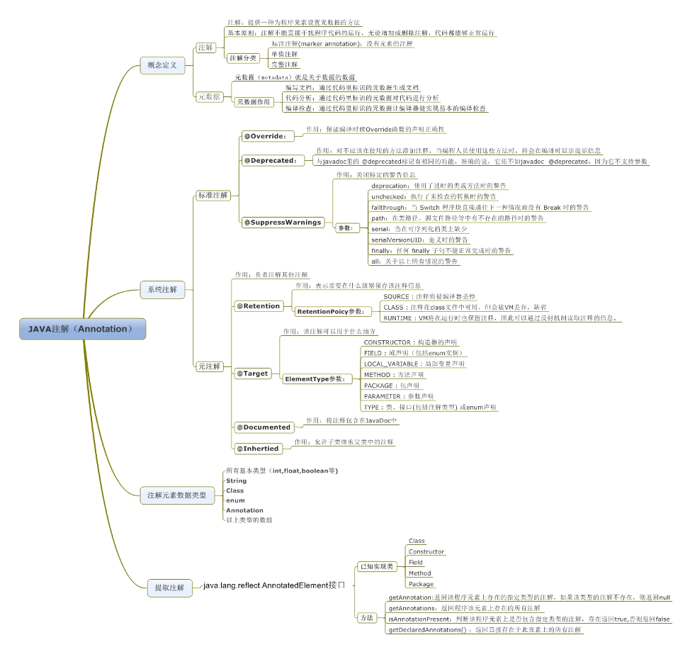

### 1.2 Spring配置常用注解

* @Configuration

@Configuration这个Annotation就是JavaConfig的典型代表啦，标注了这个Annotation的Java类定义会以Java代码的形式（对应于xml定义的形式）提供一系列的bean定义和实例， 结合AnnotationConfigApplicationContext和自动扫描的功能，就可以构建一个基于Spring容器的Java应用了。

可以通过如下两个图片看两者的区别。
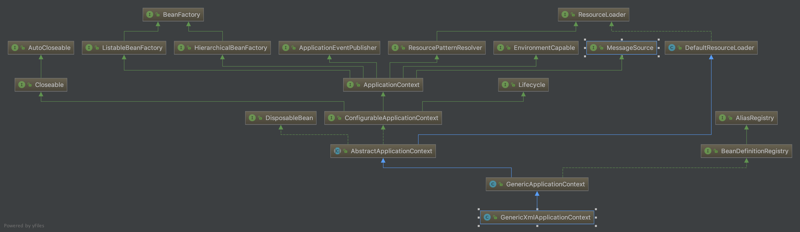
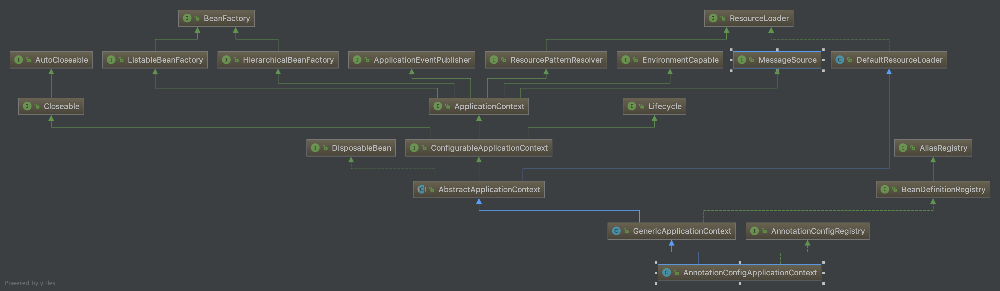

* @ComponentScan
  
@ComponentScan对应xml时代的<context:component-scan>, 用来扫描classpath下标注了相应Annotation的bean定义，然后加载到Spring容器之中。
一般配合@Configuration来使用， 你可以将@Configuraiton做的事情是纯手工定义bean然后添加到Spring容器， 而@ComponentScan则是自动收集bean定义并添加到Spring容器。

* @Import

Spring容器的配置可以分散在多个物理存在的配置类或者配置文件中， @Import允许将其它JavaConfig形式的配置类引入到当前的@Configuration标注的配置类当中， 对应于原来xml时代的<import/>, 甚至于也可以通过@ImportResource将xml形式定义的配置也引入当前JavaConfig形式的配置类当中。

* @PropertySource

配合@Configuration使用， 用来加载.properties内容到Environment，
比如：@PropertySource("classpath:/application.properties")，当然，要生效， 同时需要容器中配置一个PropertySourcesPlaceholderConfigurer。

@PropertySource和@PropertySources的区别在于， 后者属于前者的Aggregation类型， 在有多个.properties资源需要引入的情况下，
则只需要声明多个@PropertySource就行了， 否则使用@PropertySources然后再其中引用多个@PropertySource好了。

* Environment和Profile

这两个概念应该是Spring3时代引入的， Environment用来统一表达当前应用程序运行环境的概念，会以Properties的形式提供一系列该环境下的上下文信息，而且允许当前应用程序获取activeProfile是哪个。

Profile一般用来提供某些灵活性， 但这种灵活性是内部化的， 这意味着， 你的软件实体需要知道外面可能提供多少种profiles， 然后在不同的profile下，软件实体需要做什么样的调整。在例子中：我们使用了dev，test，prod等profile来实现不同。

### 1.3 深入理解@EnableAutoConfiguration

之前提到的所有Annotation都属于SpringFramework提供的， 现在要说的这个Annotation，即@EnableAutoConfiguration， 则属于SpringBoot。
@EnableAutoConfiguration是借助@Import的帮助，将所有符合自动配置条件的bean定义加载到IoC容器。

@EnableAutoConfiguration是一个复合Annotation，最关键的要属@Import(EnableAutoConfigurationImportSelector.class)，借助EnableAutoConfigurationImportSelector，@EnableAutoConfiguration可以帮助SpringBoot应用将所有符合条件的@Configuration配置都加载到当前SpringBoot创建并使用的IoC容器。

借助于Spring框架原有的一个工具类：SpringFactoriesLoader的支持，@EnableAutoConfiguration可以智能的自动配置功效才得以大功告成！
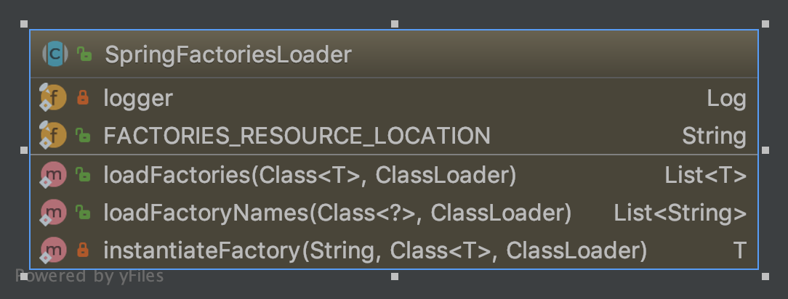

SpringFactoriesLoader属于Spring框架私有的一种扩展方案，其主要功能就是从指定的配置文件META-INF/spring.factories加载配置。
配合@EnableAutoConfiguration使用的话，它更多是提供一种配置查找的功能支持，即根据@EnableAutoConfiguration的完整类名org.springframework.boot.autoconfigure.EnableAutoConfiguration作为查找的Key,获取对应的一组@Configuration类.

从classpath中搜寻所有的META-INF/spring.factories配置文件，并将其中org.springframework.boot.autoconfigure.EnableutoConfiguration对应的配置项通过反射（Java Refletion）实例化为对应的标注了@Configuration的JavaConfig形式的IoC容器配置类，然后汇总为一个并加载到IoC容器。

property属性的各种配置方式：

***参照例子chapter3-1***

### 1.4 条件配置

```java
public interface Condition {

/**
 * Determine if the condition matches.
 * @param context the condition context
 * @param metadata metadata of the {@link org.springframework.core.type.AnnotationMetadata class}
 * or {@link org.springframework.core.type.MethodMetadata method} being checked.
 * @return {@code true} if the condition matches and the component can be registered
 * or {@code false} to veto registration.
 */
boolean matches(ConditionContext context, AnnotatedTypeMetadata metadata);
}
```

Spring的条件化配置，当我们向spring注册bean时，可以对这个bean添加一定的自定义条件，当满足这个条件时注册这个bean，否则不注册。springboot中部分实现子类如下
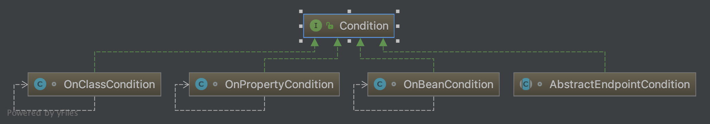

springboot更多实现请查看org.springframework.boot.autoconfigure.condition包。Condition一般配合@Conditional使用

```java
@Target({ElementType.TYPE, ElementType.METHOD})
@Retention(RetentionPolicy.RUNTIME)
@Documented
public @interface Conditional {

    /**
     * All {@link Condition}s that must {@linkplain Condition#matches match}
     * in order for the component to be registered.
     */
    Class<? extends Condition>[] value();

}
```

Spring的条件注解，其value是一个Class<? extends Condition>[]，只有数组中的全部Condition全部匹配成功时，被@Conditional修饰的组件才会被注册到Spring容器中。@Conditional只是一个标志，标示需要进行条件判断，而具体的判断规则则由具体的Condition来实现。

在SpringBoot源码中很容易看到被@Conditional注解的组合注解，例如：@ConditionalOnBean、@ConditionalOnMissingBean、@ConditionalOnClass、@ConditionalOnMissingClass等，具体如下

SpringBoot提供了一些条件注解类用于项目的自动配置。
<table>
<tr><td>条件注解</td><td>配制生成条件</td></tr>
<tr><td>@ConditionalOnBean</td><td>配置了某个特定的Bean</td></tr>
<tr><td>@ConditionalOnMissingBean</td><td>没有配置特定的Bean</td></tr>
<tr><td>@ConditionalOnClass</td><td>Classpath里有指定的类</td></tr>
<tr><td>@ConditionalOnMissingClass</td><td>Classpath里没有指定的类</td></tr>
<tr><td>@ConditionalOnExpression</td><td>给定的Spring Expression Language (SpEL)表达式计算结果为True</td></tr>
<tr><td>@ConditionalOnJava</td><td>Java的版本匹配特定值或者一个范围值</td></tr>
<tr><td>@ConditionalOnJndi</td><td>参数值给定的JNDI位置必须存在一个，如果没有参数，则要有JNDI InitialContext</td></tr>
<tr><td>@ConditionalOnProperty</td><td>制定的配置属性要有一个明确的值</td></tr>
<tr><td>@ConditionalOnResource</td><td>Classpath里有指定的资源</td></tr>
<tr><td>@ConditionalOnWebApplication</td><td>这是一个web应用程序</td></tr>
<tr><td>@ConditionalOnNotWebApplication<td>这不是一个web应用程序</td></tr>
</table>

springboot还提供了AutoConfigureAfter、AutoConfigureBefore、AutoConfigureOrder，看名字基本知道其作用。

* @Configuration修饰的配置类是何时解析的
ConfigurationClassPostProcessor是一个BeanFactoryPostProcessor（可以查看ConfigurationClassPostProcessor的类继承结构图），那么我们从AbstractApplicationContext的refresh方法调用的invokeBeanFactoryPostProcessors(beanFactory)方法开始
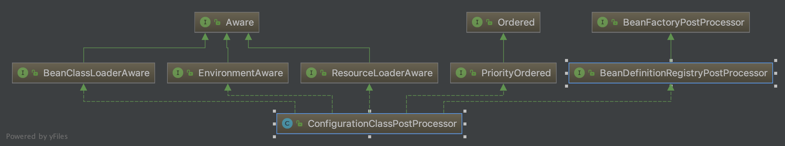

在AbstractApplicationContext查看invokeBeanFactoryPostProcessors来触发ConfigurationClassPostProcessor处理：
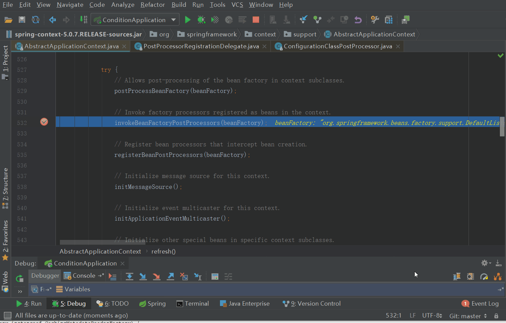

从PostProcessorRegistrationDelegate.invokeBeanFactoryPostProcessors来到了ConfigurationClassPostProcessor.processConfigBeanDefinitions方法，其详细代码如下

```java
/**
 * Build and validate a configuration model based on the registry of
 * {@link Configuration} classes.
 *  验证@Configuration修饰的类，满足条件则构建成configuration model
 */
public void processConfigBeanDefinitions(BeanDefinitionRegistry registry) {
    List<BeanDefinitionHolder> configCandidates = new ArrayList<>();
    String[] candidateNames = registry.getBeanDefinitionNames();

    for (String beanName : candidateNames) {
        BeanDefinition beanDef = registry.getBeanDefinition(beanName);
        if (ConfigurationClassUtils.isFullConfigurationClass(beanDef) ||
                ConfigurationClassUtils.isLiteConfigurationClass(beanDef)) {
            if (logger.isDebugEnabled()) {
                logger.debug("Bean definition has already been processed as a configuration class: " + beanDef);
            }
        }
        else if (ConfigurationClassUtils.checkConfigurationClassCandidate(beanDef, this.metadataReaderFactory)) {
            configCandidates.add(new BeanDefinitionHolder(beanDef, beanName));
        }
    }

    // Return immediately if no @Configuration classes were found
    if (configCandidates.isEmpty()) {
        return;
    }

    // Sort by previously determined @Order value, if applicable
    configCandidates.sort((bd1, bd2) -> {
        int i1 = ConfigurationClassUtils.getOrder(bd1.getBeanDefinition());
        int i2 = ConfigurationClassUtils.getOrder(bd2.getBeanDefinition());
        return Integer.compare(i1, i2);
    });

    // Detect any custom bean name generation strategy supplied through the enclosing application context
    // 检测自定义的bean生成策略
    SingletonBeanRegistry sbr = null;
    if (registry instanceof SingletonBeanRegistry) {
        sbr = (SingletonBeanRegistry) registry;
        if (!this.localBeanNameGeneratorSet) {
            BeanNameGenerator generator = (BeanNameGenerator) sbr.getSingleton(CONFIGURATION_BEAN_NAME_GENERATOR);
            if (generator != null) {
                this.componentScanBeanNameGenerator = generator;
                this.importBeanNameGenerator = generator;
            }
        }
    }

    if (this.environment == null) {
        this.environment = new StandardEnvironment();
    }

    // Parse each @Configuration class
    // 解析每一个被@Configuration修饰的class
    ConfigurationClassParser parser = new ConfigurationClassParser(
            this.metadataReaderFactory, this.problemReporter, this.environment,
            this.resourceLoader, this.componentScanBeanNameGenerator, registry);

    Set<BeanDefinitionHolder> candidates = new LinkedHashSet<>(configCandidates);
    Set<ConfigurationClass> alreadyParsed = new HashSet<>(configCandidates.size());
    do {
        parser.parse(candidates);    // 解析过程中会将满足条件的@Configuration class存放到configurationClasses中
        parser.validate();

        // 满足条件的@Configuration class 都存放在了parser的configurationClasses中
        Set<ConfigurationClass> configClasses = new LinkedHashSet<>(parser.getConfigurationClasses());
        configClasses.removeAll(alreadyParsed);

        // Read the model and create bean definitions based on its content
        // 读取@Configuration class中的配置（各个@Bean），并创建对应的bean definition（后续创建bean实例会用到bean定义）
        if (this.reader == null) {
            this.reader = new ConfigurationClassBeanDefinitionReader(
                    registry, this.sourceExtractor, this.resourceLoader, this.environment,
                    this.importBeanNameGenerator, parser.getImportRegistry());
        }
        this.reader.loadBeanDefinitions(configClasses);    // 加载全部@Configuration class中的配置
        alreadyParsed.addAll(configClasses);

        candidates.clear();
        if (registry.getBeanDefinitionCount() > candidateNames.length) {
            String[] newCandidateNames = registry.getBeanDefinitionNames();
            Set<String> oldCandidateNames = new HashSet<>(Arrays.asList(candidateNames));
            Set<String> alreadyParsedClasses = new HashSet<>();
            for (ConfigurationClass configurationClass : alreadyParsed) {
                alreadyParsedClasses.add(configurationClass.getMetadata().getClassName());
            }
            for (String candidateName : newCandidateNames) {
                if (!oldCandidateNames.contains(candidateName)) {
                    BeanDefinition bd = registry.getBeanDefinition(candidateName);
                    if (ConfigurationClassUtils.checkConfigurationClassCandidate(bd, this.metadataReaderFactory) &&
                            !alreadyParsedClasses.contains(bd.getBeanClassName())) {
                        candidates.add(new BeanDefinitionHolder(bd, candidateName));
                    }
                }
            }
            candidateNames = newCandidateNames;
        }
    }
    while (!candidates.isEmpty());

    // Register the ImportRegistry as a bean in order to support ImportAware @Configuration classes
    if (sbr != null && !sbr.containsSingleton(IMPORT_REGISTRY_BEAN_NAME)) {
        sbr.registerSingleton(IMPORT_REGISTRY_BEAN_NAME, parser.getImportRegistry());
    }

    if (this.metadataReaderFactory instanceof CachingMetadataReaderFactory) {
        // Clear cache in externally provided MetadataReaderFactory; this is a no-op
        // for a shared cache since it'll be cleared by the ApplicationContext.
        ((CachingMetadataReaderFactory) this.metadataReaderFactory).clearCache();
    }
}
```

@Conditional是何时生效、如何生效的
便是上面代码调用 ConfigurationClassBeanDefinitionReader.loadBeanDefinitions
通过TrackedConditionEvaluator里面shouldSkip方法实现。具体实现在ConditionEvaluator里面，对表达式进行处理。

```java
public boolean shouldSkip(ConfigurationClass configClass) {
Boolean skip = this.skipped.get(configClass);
if (skip == null) {
    if (configClass.isImported()) {
        boolean allSkipped = true;
        for (ConfigurationClass importedBy : configClass.getImportedBy()) {
            if (!shouldSkip(importedBy)) {
                allSkipped = false;
                break;
            }
        }
        if (allSkipped) {
            // The config classes that imported this one were all skipped, therefore we are skipped...
            skip = true;
        }
    }
    if (skip == null) {
        skip = conditionEvaluator.shouldSkip(configClass.getMetadata(), ConfigurationPhase.REGISTER_BEAN);
    }
    this.skipped.put(configClass, skip);
}
return skip;
}
```

上面已经全部得到体现，Spring不会无脑的加载所有的@Configuration class，只会加载满足条件的@Configuration class，而@Conditional就是条件标志，至于条件匹配规则这由Condition提供；shouldSkip方法中用到Conditional和Condition，完成条件的匹配处理。

autoConfig以及spring.factories的使用方式：

***参照例子chapter3-2***

## 2. springboot 的web 开发

* 静态资源访问

Spring Boot默认提供静态资源目录位置需置于classpath下，目录名需符合如下规则：

1. /static
2. /public
3. /resources
4. /META-INF/resources
  
举例：我们可以在src/main/resources/目录下创建static，在该位置放置一个图片文件。启动程序后，
尝试访问http://localhost:8080/D.jpg。如能显示图片，配置成功。

* 渲染Web页面

在之前的示例中，我们都是通过@RestController来处理请求，所以返回的内容为json对象。那么如果需要渲染html页面的时候，要如何实现呢？

答案是：模板引擎

在动态HTML实现上Spring Boot依然可以完美胜任，并且提供了多种模板引擎的默认配置支持，所以在推荐的模板引擎下，我们可以很快的上手开发动态网站。

Spring Boot提供了默认配置的模板引擎主要有以下几种：

1. Thymeleaf
2. FreeMarker
3. Velocity
4. Groovy
5. Mustache

使用上述模板引擎中的任何一个，它们默认的模板配置路径为：src/main/resources/templates。当然也可以修改这个路径，具体如何修改，可在后续各模板引擎的配置属性中查询并修改。

* Thymeleaf
  
Thymeleaf是一个XML/XHTML/HTML5模板引擎，可用于Web与非Web环境中的应用开发。它是一个开源的Java库，基于Apache License 2.0许可，由Daniel Fernández创建，该作者还是Java加密库Jasypt的作者。

Thymeleaf提供了一个用于整合Spring MVC的可选模块，在应用开发中，你可以使用Thymeleaf来完全代替JSP或其他模板引擎，如Velocity、FreeMarker等。Thymeleaf的主要目标在于提供一种可被浏览器正确显示的、格式良好的模板创建方式，因此也可以用作静态建模。你可以使用它创建经过验证的XML与HTML模板。相对于编写逻辑或代码，开发者只需将标签属性添加到模板中即可。接下来，这些标签属性就会在DOM（文档对象模型）上执行预先制定好的逻辑。

示例模板：

```html
<table>
  <thead>
    <tr>
      <th th:text="#{msgs.headers.name}">Name</td>
      <th th:text="#{msgs.headers.price}">Price</td>
    </tr>
  </thead>
  <tbody>
    <tr th:each="prod : ${allProducts}">
      <td th:text="${prod.name}">Oranges</td>
      <td th:text="${#numbers.formatDecimal(prod.price,1,2)}">0.99</td>
    </tr>
  </tbody>
</table>
```

可以看到Thymeleaf主要以属性的方式加入到html标签中，浏览器在解析html时，当检查到没有的属性时候会忽略，所以Thymeleaf的模板可以通过浏览器直接打开展现，这样非常有利于前后端的分离。

在Spring Boot中使用Thymeleaf，只需要引入下面依赖，并在默认的模板路径src/main/resources/templates下编写模板文件即可完成。

```text
<dependency>
<groupId>org.springframework.boot</groupId>
<artifactId>spring-boot-starter-thymeleaf</artifactId>
</dependency>
```

在完成配置之后，举一个简单的例子，在快速入门工程的基础上，举一个简单的示例来通过Thymeleaf渲染一个页面。

```java
@Controller
public class HelloController {

    @RequestMapping("/")
    public String index(ModelMap map) {
        // 加入一个属性，用来在模板中读取
        map.addAttribute("host", "https://github.com/huqianghui/springboot-study");
        // return模板文件的名称，对应src/main/resources/templates/index.html
        return "index";  
    }

}
```

```html
<!DOCTYPE html>
<html>
<head lang="en">
    <meta charset="UTF-8" />
    <title></title>
</head>
<body>
<h1 th:text="${host}">Hello World</h1>
</body>
</html>
```

如上页面，直接打开html页面展现Hello World，但是启动程序后，访问http://localhost:8080/，
则是展示Controller中host的值：https://github.com/huqianghui/springboot-study，做到了不破坏HTML自身内容的数据逻辑分离。

更多Thymeleaf的页面语法，还请访问Thymeleaf的官方文档查询使用。

* Thymeleaf的默认参数配置

如有需要修改默认配置的时候，只需复制下面要修改的属性到application.properties中，并修改成需要的值，如修改模板文件的扩展名，修改默认的模板路径等。

```text
# Enable template caching.
spring.thymeleaf.cache=true 
# Check that the templates location exists.
spring.thymeleaf.check-template-location=true 
# Content-Type value.
spring.thymeleaf.content-type=text/html 
# Enable MVC Thymeleaf view resolution.
spring.thymeleaf.enabled=true 
# Template encoding.
spring.thymeleaf.encoding=UTF-8 
# Comma-separated list of view names that should be excluded from resolution.
spring.thymeleaf.excluded-view-names= 
# Template mode to be applied to templates. See also StandardTemplateModeHandlers.
spring.thymeleaf.mode=HTML5 
# Prefix that gets prepended to view names when building a URL.
spring.thymeleaf.prefix=classpath:/templates/ 
# Suffix that gets appended to view names when building a URL.
spring.thymeleaf.suffix=.html  spring.thymeleaf.template-resolver-order= # Order of the template resolver in the chain. spring.thymeleaf.view-names= # Comma-separated list of view names that can be resolved.
```

***Thymeleaf,freemarker,velocity的代码参照：charter3-3***

## 2.spring mvc详解

springMVC的处理流程图
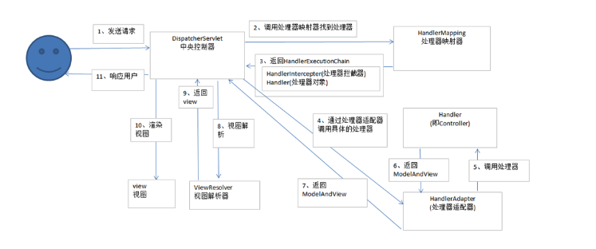

1. 用户发送请求至前端控制器DispatcherServlet

2. DispatcherServlet收到请求调用HandlerMapping处理器映射器。

3. 处理器映射器根据请求url找到具体的处理器，生成处理器对象及处理器拦截器(如果有则生成)一并返回给DispatcherServlet。

4. DispatcherServlet通过HandlerAdapter处理器适配器调用处理器

5. 执行处理器(Controller，也叫后端控制器)。

6. Controller执行完成返回ModelAndView

7. HandlerAdapter将controller执行结果ModelAndView返回给DispatcherServlet

8. DispatcherServlet将ModelAndView传给ViewReslover视图解析器

9. ViewReslover解析后返回具体View

10. DispatcherServlet对View进行渲染视图（即将模型数据填充至视图中）。

11. DispatcherServlet响应用户。

从上面可以看出，DispatcherServlet有接收请求，响应结果，转发等作用。有了DispatcherServlet之后，可以减少组件之间的耦合度。
同时从图中可以看出，SpringMVC本质上是一个Servlet,这个 Servlet 继承自 HttpServlet。FrameworkServlet负责初始化SpringMVC的容器，
并将Spring容器设置为父容器。这几点从DispatcherServlet也能看出。
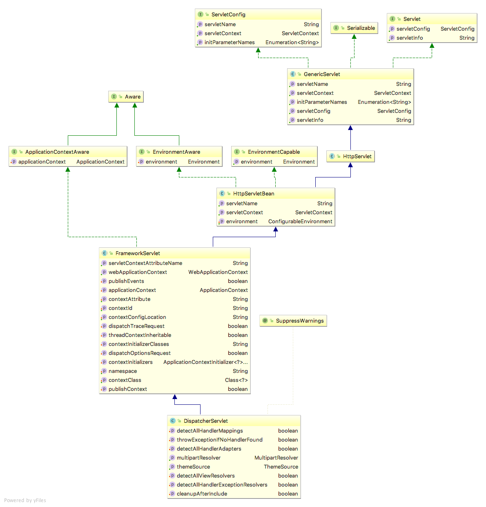

DispatcherServlet的initStrategies方法会初始化9大组件，但是这里将实现一些SpringMVC的最基本的组件而不是全部。

初始化阶段完成如下几件事情：

1. 加载配置文件

2. 扫描用户配置包下面所有的类

3. 拿到扫描到的类，通过反射机制，实例化。并且放到ioc容器中(Map的键值对 beanName-bean) beanName默认是首字母小写

4. 初始化HandlerMapping，这里其实就是把url和method对应起来放在一个k-v的Map中,在运行阶段取出

代码DispatcherServlet中通过initStrategies方法：

```java
protected void initStrategies\(ApplicationContext context\) {
    initMultipartResolver\(context\);

    initLocaleResolver\(context\);

    initThemeResolver\(context\);

    initHandlerMappings\(context\);

    initHandlerAdapters\(context\);

    initHandlerExceptionResolvers\(context\);

    initRequestToViewNameTranslator\(context\);

    initViewResolvers\(context\);

    initFlashMapManager\(context\);

}
```

然后运行期每一次请求将会调用doGet或doPost方法，所以统一运行阶段都放在doDispatch方法里处理，它会根据url请求去HandlerMapping中匹配到对应的Method，然后利用反射机制调用Controller中的url对应的方法，并得到结果返回。

1）是否是文件上传

2）查找对应的Handler

3）获取请求传入的参数并处理参数

4）是否是异步处理

5）view或返回结果处理

6）异常处理

7）完成后的事件派发等等

HandlerMapping

在dispatcherServlet,doDispatch方法中有调用getHandler，代码如下：

其中List&lt; HandlerMapping&gt; handlerMappings是dispatcherServlet的内部变量。

那该方法的内容就是遍历handlerMappings,获得符合条件的HandlerMapping,调用其getHandler方法，返回获得的HandlerExecutionChain。

***Mapping Handler 顺序***
另外一个要讨论的就是顺序问题，不同hander负责映射的条件可能有重复的，这时候就需要定义不同的HandlerMapping执行的顺序，这里的顺序可以通过实现Order接口，通过Order属性定义。order越小越先使用。

如果发现有两个相同的handler则会抛出异常。所以当我们书写RequestMapping的时候value部分和method部分最好有一个规范，同时不要省略。因为SpringMVC的匹配功能很强大，有很多默认的

推算，所以当requestHandler相对比较少的时候，大家都可以相安无事。但是随着系统复杂，requestHandler的增加，一些错误就会显示出来。而且对Swagger等地方工具抽取出来的内容也会不完善。

所以建议大家能有统一的一个规范，形成一套完整的API信息。

其他主题的话，大家有兴趣可以额外介绍，然后通过两个例子使用Spring MVC

***文件上传功能参照charter4-1***

* 配置MultipartResolver处理文件
SpringMVC 用的是 的MultipartFile来进行文件上传 所以我们首先要配置MultipartResolver:用于处理表单中的file。

```text
# Enable multipart uploads
spring.servlet.multipart.enabled=true
# Threshold after which files are written to disk.
spring.servlet.multipart.file-size-threshold=2KB
# Max file size.
spring.servlet.multipart.max-file-size=200MB
# Max Request Size
spring.servlet.multipart.max-request-size=215MB
```

* 多个文件上传
多个文件组使用同一个name名称:files，后台控制器使用@RequestParam(“files”) MultipartFile[] files 数组来接收。

***跨域请求问题 charter4-2***

出于安全考虑，XMLHttpReqeust 对象发起的 HTTP 请求必须满足同源策略（same-origin policy）的规定，否则浏览器将会对该请求进行限制。虽然同源策略的实现带来的Web安全的提升，但是却为一些正规的跨域需求带来不便，故此衍生出了若干种绕开同源策略的跨域方案。
如下基于springmvc，介绍几种实现解决跨域请求的方法。

* 使用Servlet Filter 实现 CORS

CORS 跨域协议的实现是通过使用一组 HTTP 首部字段实现的，其核心是服务端返回响应中的 Access-Control-Allow-Origin 首部字段，这个字段来声明服务端允许来自哪些源的请求访问该资源，浏览器可以根据这个响应首部字段来判断是否可以放行跨域请求。因此要实现 CORS ，我们可以在项目中声明一个 Filter 过滤器为响应加上需要的 Access-Control-Allow-*首部。

```java
import javax.servlet.*;
import javax.servlet.http.HttpServletResponse;
import java.io.IOException;

public class CORSFilter implements Filter{

    @Override
    public void init(FilterConfig filterConfig) throws ServletException {

    }

    @Override
    public void doFilter(ServletRequest servletRequest, ServletResponse servletResponse, FilterChain filterChain) throws IOException, ServletException {
        System.out.println("work");
        HttpServletResponse response = (HttpServletResponse) servletResponse;
        response.setHeader("Access-Control-Allow-Origin", "*");
        response.setHeader("Access-Control-Allow-Methods", "POST, GET");
        response.setHeader("Access-Control-Max-Age", "3600");
        response.setHeader("Access-Control-Allow-Headers", "Content-Type, Access-Control-Allow-Headers, Authorization, X-Requested-With");
        filterChain.doFilter(servletRequest, servletResponse);
    }

    @Override
    public void destroy() {

    }
}
```

把这个bean注册到context里面，就可以简单的实现 CORS 跨域请求了，上面的过滤器将会为所有请求的响应加上Access-Control-Allow-*首部，换言之就是允许来自任意源的请求来访问该服务器上的资源。而在实际开发中可以根据需要开放跨域请求权限以及控制响应头部等等。

* 使用 Spring MVC 的 @CrossOrigin 注解实现 CORS 跨域

Spring Framework 从 4.2 版本中开始原生支持 CORS，相比上面的需要配置 Filter 过滤器的实现方式，使用原生的 @CrossOrigin 注解的实现方式来得更加简单。要启用 Spring MVC 的 CORS 支持十分简单，只需要添加一个@CrossOrigin注解即可，根据添加注解位置可以控制配置的细粒度，如：允许这个Controller 还是特定的方法。

```java
@RestController
@RequestMapping("/account")
public class AccountController {

  @CrossOrigin
  @GetMapping("/{id}")
  public Account retrieve(@PathVariable Long id) {
      // ...
  }

  @DeleteMapping("/{id}")
  public void remove(@PathVariable Long id) {
      // ...
  }
}
```

* 全局 CORS 配置
在某些情况，我们并不需要针对不同的URL来配置不同 CORS 属性，那么我们可以通过一个全局的 CORS 配置来避免单独注解配置的麻烦。
只需要简单加入以下的代码就可以配置全局的 CORS。默认情况下，将允许来自任意源站以及任意 HTTP 请求方法的请求访问。

```java
@Configuration
@EnableWebMvc
public class WebConfig extends WebMvcConfigurerAdapter {

    @Override
    public void addCorsMappings(CorsRegistry registry) {
        registry.addMapping("/api/**")
                .allowedOrigins("http://domain2.com")
                .allowedMethods("PUT", "DELETE")
                .allowedHeaders("header1", "header2", "header3")
                .exposedHeaders("header1", "header2")
                .allowCredentials(false).maxAge(3600);
    }
}
```

### context Listener

上面介绍了servlet，和filter。在容器中还有一个重要角色就是lister，通过一些处理一些特定时间。
示例代码如下：

```java
public class HuContextLoaderListener extends ContextLoaderListener {
public HuContextLoaderListener() {
    super();
}

public HuContextLoaderListener(WebApplicationContext context) {
    super(context);
}

public final static String CTX_KEY__SPRING_ACTIVE_PROFILES = "spring.profiles.active";

// DONE
@Override
public void contextDestroyed(ServletContextEvent event) {
    super.contextDestroyed(event);
    SpringContextManager.closeApplicationContext();;
}

/**
 * create application context wrapper,and init all sub application context
 */
@Override
protected WebApplicationContext createWebApplicationContext(
        ServletContext sc) {
    TestXmlWebApplicationContext context = new TestXmlWebApplicationContext();
    // set to SpringContextManager first,can be used during context init
    SpringContextManager.setApplicationContext(context);
    initApplicationContext(sc, context);
    return context;
}

private void initApplicationContext(ServletContext sc,
        TestXmlWebApplicationContext context) {
    String[] activeProfiles = getActiveProfiles(sc);
    context.getEnvironment().setActiveProfiles(activeProfiles);
}


private String toString(String[] activeProfiles) {
    StringBuffer buffer=new StringBuffer();
    for(String profile:activeProfiles)
    {
        buffer.append(",").append(profile);
    }
    return buffer.length()>0?buffer.substring(1):buffer.toString();
}

private String[] getActiveProfiles(ServletContext servletContext) {
    String profiles=Env.getParameter(AbstractEnvironment.ACTIVE_PROFILES_PROPERTY_NAME);
    if(org.springframework.util.StringUtils.hasText(profiles))
    {
        return profiles.split(",");
    }else
    {
        return new String[0];
    }
}


@Override
protected Class<?> determineContextClass(ServletContext servletContext) {
    throw new RuntimeException("This method should not be used!");
}

// NOT CHANGE
@Override
public void closeWebApplicationContext(ServletContext servletContext) {
    super.closeWebApplicationContext(servletContext);
}

}

```

### springMVC 序列化

Spring 自带了各种各样的转换器，这些转换器满足了最常见的将对象转换为表述的需要。Spring 提供了多个 HTTP 信息转换器，用于实现资源表述与各种 Java 类型之间的互相转换。
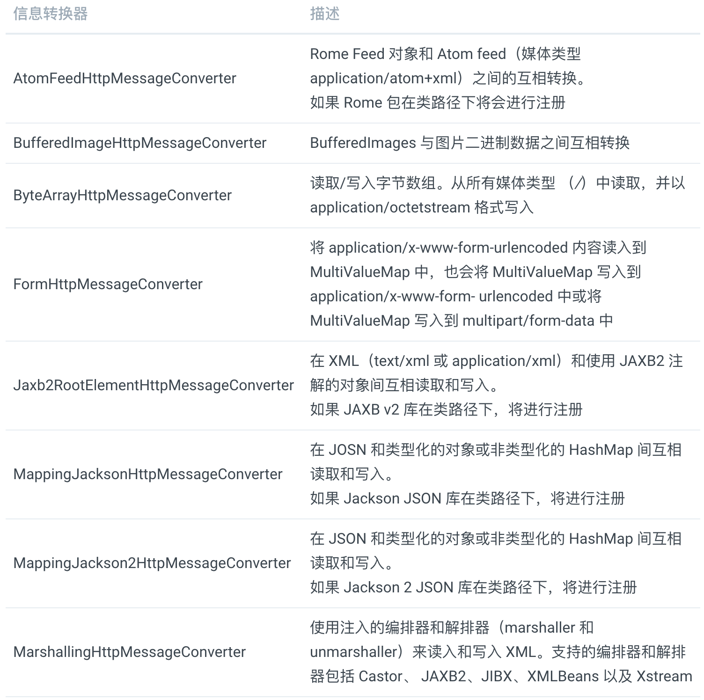
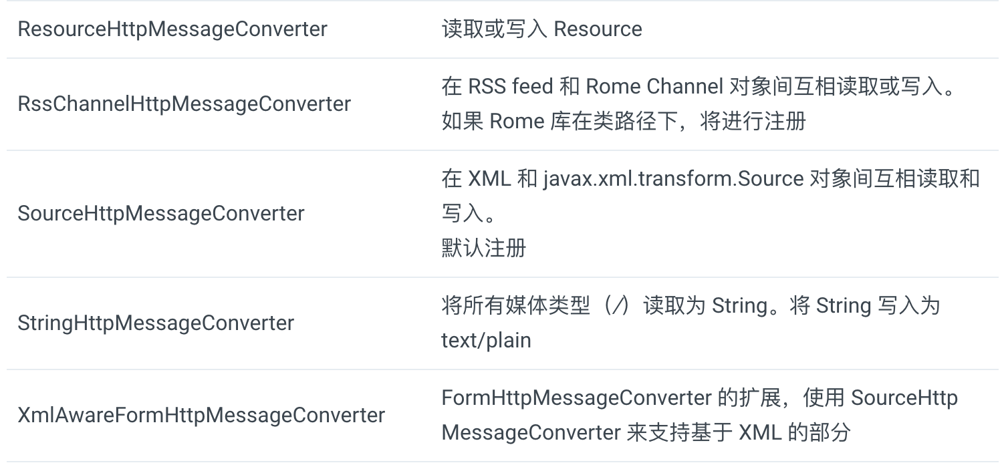

例如，假设客户端通过请求的 Accept 头信息表明它能接受 “application/json”，并且 Jackson JSON 在类路径下，那么处理方法返回的对象将交给 MappingJacksonHttpMessageConverter，并由它转换为返回客户端的 JSON 表述形式。另一方面，如果请求的头信息表明客户端想要 “text/xml” 格式，那么 Jaxb2RootElementHttpMessageConverter 将会为客户端产生 XML 响应。

其中很多不需要 Spring 配置，是根据classpath的class是否存在自动装载的。你只需要添加一些库到应用程序的类路径下。例如，如果你想使用 MappingJacksonHttpMessageConverter 来实现 JSON 消息和 Java 对象的互相转换，那么需要将 Jackson JSON Processor 库添加到类路径中。类似地，如果你想使用 Jaxb2RootElementHttpMessageConverter 来实现 XML 消息和 Java 对象的互相转换，那么需要 JAXB 库。如果信息是 Atom 或 RSS 格式的话，那么 AtomFeedHttpMessageConverter 和 RssChannelHttpMessageConverter 会需要 Rome 库。

注意在默认情况下，Jackson JSON 库在将返回的对象转换为 JSON 资源表述时，会使用反射。对于简单的表述内容来讲，这没有什么问题。但是如果你重构了 Java 类型，比如添加、移除或重命名属性，那么所产生的 JSON 也将会发生变化（如果客户端依赖这些属性的话，那客户端有可能会出错）。
但是，我们可以在 Java 类型上使用 Jackson 的映射注解，从而改变产生 JSON 的行为。这样我们就能更多地控制所产生的 JSON，从而防止它影响到 API 或客户端。

这里具体看看jackson的一些常用注解：

1. @JsonProperty :此注解用于属性上，作用是把该属性的名称序列化为另外一个名称，如把trueName属性序列化为name，@JsonProperty("name")。 

对属性名称重命名，比如在很多场景下Java对象的属性是按照规范的驼峰书写，但在数据库设计时使用的是下划线连接方式，此处在进行映射的时候

就可以使用该注解。
2. @JsonIgnore此注解用于属性或者方法上（最好是属性上），用来完全忽略被注解的字段和方法对应的属性，即便这个字段或方法可以被自动检测到或者还有其

他的注解，一般标记在属性或者方法上，返回的json数据即不包含该属性。
3. @JsonIgnoreProperties此注解是类注解，作用是json序列化时将java bean中的一些属性忽略掉，序列化和反序列化都受影响。
4. @JsonFormat此注解用于属性或者方法上（最好是属性上），可以方便的把Date类型直接转化为我们想要的模式。
5. @JsonSerialize此注解用于属性或者getter方法上，用于在序列化时嵌入我们自定义的代码，比如序列化一个double时在其后面限制两位小数点。
6. @JsonDeserialize此注解用于属性或者setter方法上，用于在反序列化时可以嵌入我们自定义的代码，类似于上面的@JsonSerialize。
7. @JsonInclude 属性值为null的不参与序列化。例子：@JsonInclude(Include.NON_NULL)
例子：@JsonFormat(pattern="yyyy-MM-dd hh:mm:ss")

* 上面都是对一个个POJO或者Bean作用，但是如果我们想整体改变的时候，比如首字母大小写，日期格式等的时候，就需要客户化messageConverter这个类了。
实例代码如下：

jsonBaseUtils.java

```java
private static void initMapper() {
        objectMapper = new ObjectMapper();
        objectMapper.setSerializationInclusion(JsonInclude.Include.NON_NULL);
        objectMapper.setDateFormat(new ISO8601WithoutTimeZoneDateFormat());
        objectMapper.configure(MapperFeature.SORT_PROPERTIES_ALPHABETICALLY, true);
        objectMapper.configure(MapperFeature.REQUIRE_SETTERS_FOR_GETTERS, true);
        objectMapper.configure(MapperFeature.CAN_OVERRIDE_ACCESS_MODIFIERS, false);
        objectMapper.configure(DeserializationFeature.USE_BIG_DECIMAL_FOR_FLOATS, true);
        objectMapper.configure(JsonGenerator.Feature.WRITE_BIGDECIMAL_AS_PLAIN, true);
        objectMapper.setPropertyNamingStrategy(new PropertyNamingStrategy.PascalCaseStrategy());
        objectMapper.configure(JsonParser.Feature.ALLOW_COMMENTS, true);
        objectMapper.registerModules(new JavaTimeModule());
    }
```

***完整代码参照chapter4-3***

## 3. spring 关系型数据库操作

* 数据源配置方式
  
1. JNDI(Java Naming and Directory Interface,Java命名和目录接口)

Java EE 应用服务器中，如 WebSphere、 JBoss 或甚至像 Tomcat 这样的 Web 容器中服务器允许你配置通过 JNDI 获取数据源。这种配置的好处在于数据源完全可以在应用程序之外进行管理，这样应用程序只需在访问数据库的时候查找数据源就可以了。另外，在应用服务器中管理的数据源通常以池的方式组织，从而具备更好的性能，并且还支持系统管理员对其进行热切换。 但是对平台有依赖。
2. 数据源连接池
Spring 并没有提供数据源连接池实现，但是我们有多项可用的方案，包括如下开源的实现：

* Apache Commons DBCP

* c3p0

* BoneCP
这些连接池中的大多数都能配置为 Spring 的数据源，在一定程度上与 Spring 自带的 DriverManagerDataSource 或 SingleConnectionDataSource 很类似。

```java
@Bean
public BasicDataSource dataSource() {
  BasicDataSource ds = new BasicDataSource();
  ds.setDriverClassName("org.h2.Driver");
  ds.setUrl("jdbc:h2:tcp://localhost/~/spitter");
  ds.setUsername("sa");
  ds.setPassword("");
  ds.setInitialSize(5);
  ds.setMaxActive(10);
  return ds;
}
```

前四个属性是配置 BasicDataSource 所必需的。属性 driverClassName 指定了 JDBC 驱动类的全限定类名。在这里我们配置的是 H2 数据库的数据源。属性 url 用于设置数据库的 JDBC URL。最后，username 和 password 用于在连接数据库时进行认证。
以上四个基本属性定义了 BasicDataSource 的连接信息。除此以外，还有多个配置数据源连接池的属性。表 10.3 列出了 DBCP BasicDataSource 最有用的一些池配置属性：
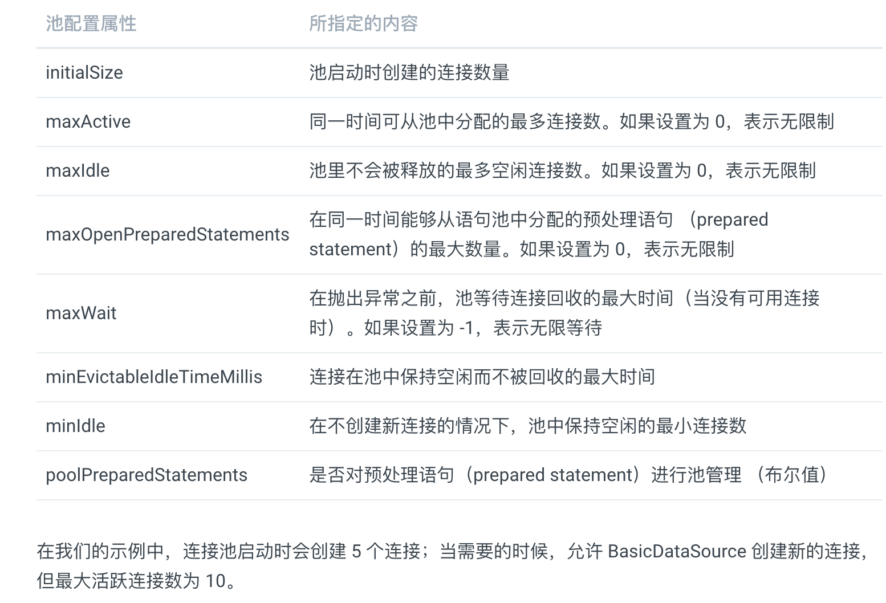
3. 基于JDBC 驱动的数据源

在 Spring 中，通过 JDBC 驱动定义数据源是最简单的配置方式。Spring 提供了三个这样的数据源类（均位于 org.springframework.jdbc.datasource 包中）供选择：

DriverManagerDataSource：在每个连接请求时都会返回一个新建的连接。与 DBCP 的 BasicDataSource 不同， 由 DriverManagerDataSource 提供的连接并没有进行池化管理；

SimpleDriverDataSource：与 DriverManagerDataSource 的工作方式类似，但是它直接使用 JDBC 驱动，来解决在特定环境下的类加载问题，这样的环境包括 OSGi 容器；

SingleConnectionDataSource：在每个连接请求时都会返回同一个的连接。尽管 SingleConnectionDataSource 不是严格意义上的连接池数据源，但是你可以将其视为只有一个连接的池。

以上这些数据源的配置与 DBCPBasicDataSource 的配置类似。例如，如下就是配置 DriverManagerDataSource 的方法：

```java
@Bean
public DataSource dataSource() {
  DriverManagerDataSource ds = new DriverManagerDataSource();
  ds.setDriverClassName("org.h2.Driver");
  ds.setUrl("jdbc:h2:tcp://localhost/~/spitter");
  ds.setUsername("sa");
  ds.setPassword("");
  return ds;
}
```

与具备池功能的数据源相比，唯一的区别在于这些数据源 bean 都没有提供连接池功能，所以没有可配置的池相关的属性。
尽管这些数据源对于小应用或开发环境来说是不错的，但是要将其用于生产环境，你还是需要慎重考虑。因为 SingleConnectionDataSource 有且只有一个数据库连接，所以不适合用于多线程的应用程序，最好只在测试的时候使用。而 DriverManagerDataSource 和 SimpleDriverDataSource 尽管支持多线程，但是在每次请求连接的时候都会创建新连接，这是以性能为代价的。鉴于以上的这些限制，强烈建议应该使用数据源连接池。

### 3.1 Spring 和JDBC操作数据库

* 应对失控的 JDBC 代码
如果使用 JDBC 所提供的直接操作数据库的 API，你需要负责处理与数据库访问相关的所有事情，其中包含管理数据库资源和处理异常。如果你曾经使用 JDBC 往数据库中插入数据，那如下代码对你应该并不陌生：

```java
private static final String SQL_INSERT_SPITTBR =
  "insert into spitter (username, password, fullname) values (?, ?, ?)";
private DataSource dataSource; 
public void addSpitter(Spitter spitter) {
  Connection conn = null;
  PreparedStatement stmt = null; 
  try {
    conn = dataSource.getConnection();
    stmt = conn.prepareStatement(SQL_INSERT_SPITTER);
    stmc.setstring(1, spicter.getUsername());
    stmt.setstring(2, spitter.getPassword());
    stmt.setstring(3, spitter .getFullName());
    stmt.execute();
  } catch (SQLException e) {
    // do something...not sure what, though
  } finally {
    try {
      if (stmt != null) {
        stmt.close();
      }
      if (conn != null) {
        conn.close();
      }
    } catch (SQLException e) {
      // I'm even less sure about what to do here
    }
  }
}
```

看看这些失控的代码！这个超过 20 行的代码仅仅是为了向数据库中插入一个简单的对象。对于 JDBC 操作来讲，这应该是最简单的了。但是为什么要用这么多行代码才能做如此简单的事情呢？实际上，并非如此，只有几行代码是真正用于进行插入数据的。但是 JDBC 要求你必须正确地管理连接和语句，并以某种方式处理可能抛出的 SQLException 异常。
再提一句这个 SQLException 异常：你不但不清楚如何处理它（因为并不知道哪里出错了），而且你还要捕捉它两次！你需要在插入记录出错时捕捉它，同时你还需要在关闭语句和连接出错的时候捕捉它。看起来我们要做很多的工作来处理可能出现的问题，而这些问题 通常是难以通过编码来处理的。

大量的 JDBC 代码都是用于创建连接和语句以及异常处理的样板代码。既然已经得出了这个观点，我们将不再接受它的折磨，以后你再也不会看到这样令人厌恶的代码了。
但实际上，这些样板代码是非常重要的。清理资源和处理错误确保了数据访问的健壮性。如果没有它们的话，就不会发现错误而且资源也会处于打开的状态，这将会导致意外的代码和资源泄露。我们不仅需要这些代码，而且还要保证它是正确的。基于这样的原因，我们才需要框架来保证这些代码只写一次而且是正确的。

* 使用 JDBC 模板
Spring 的 JDBC 框架承担了资源管理和异常处理的工作，从而简化了 JDBC 代码，让我们只需编写从数据库读写数据的必需代码。
正如前面小节所介绍过的，Spring 将数据访问的样板代码抽象到模板类之中。Spring 为 JDBC 提供了三个模板类供选择：
JdbcTemplate：最基本的 Spring JDBC 模板，这个模板支持简单的 JDBC 数据库访问功能以及基于索引参数的查询；
NamedParameterJdbcTemplate：使用该模板类执行查询时可以将值以命名参数的形式绑定到 SQL 中，而不是使用简单的索引参数；
SimpleJdbcTemplate：该模板类利用 Java 5 的一些特性如自动装箱、泛型以及可变参数列表来简化 JDBC 模板的使用。
以前，在选择哪一个 JDBC 模板的时候，我们需要仔细权衡。但是从 Spring 3.1 开始，做这个决定变得容易多了。SimpleJdbcTemplate 已经被废弃了，其 Java 5 的特性被转移到了 JdbcTemplate 中，并且只有在你需要使用命名参数的时候，才需要使 用 NamedParameterJdbcTemplate。这样的话，对于大多数的 JDBC 任务来说，JdbcTemplate 就是最好的可选方案，这也是本小节中所关注的方案。

使用 JdbcTemplate 来读取数据:

通过传入的SQL已经RowMapper 对象，用来从 ResultSet 中提取数据并构建域对象，不用写 JDBC 模板代码。
不同于传统的 JDBC，这里没有资源管理或者异常处理代码。使用 JdbcTemplate 的方法只需关注于如何从数据库中获取对象。

***参考代码chapter5-1***

### 3.2 Springboot整合mybatis

MyBatis 是一款优秀的持久层框架，它支持定制化 SQL、存储过程以及高级映射。它避免了几乎所有的 JDBC 代码和手动设置参数以及获取结果集。因为 MyBatis 可以使用简单的 XML 或注解来配置和映射原生信息，将接口和 Java 的 POJOs (Plain Old Java Objects，普通的 Java 对象)映射成数据库中的记录。通俗地说，MyBatis 就是我们使用 Java 程序操作数据库时的一种工具，可以简化我们使用 JDBC 时的很多操作，而且还简化了数据库记录与 POJO 之间的映射方式。

MyBatis 有以下优势：

1. 可以简化我们操作数据库的步骤。
2. 相对 Hibernate 来说学习成本较低，Hibernate 还需要学习其 HQL 查询规范。
3. 使用相对广泛。

* 集成 MyBatis
在 Spring Boot 项目中配置 MyBatis。只需要三大步骤就可以完成这个配置。
第一步是添加依赖包，第二步是配置数据库事务和会话工厂，最后一步就是配置 Mapper 的路径。

* 添加 MyBatis 相关依赖包

在 pom.xml 文件的 <dependencies> 标签下添加如下内容即可

```text
<dependency>
    <groupId>org.mybatis.spring.boot</groupId>
    <artifactId>mybatis-spring-boot-starter</artifactId>
</dependency>
```

* 配置数据库事务和会话工厂

* 配置 Mapper 路径
指定 *Mapper.java 的扫描路径（即存放 *Mapper.java 的包地址）。我们可以通过在 DataSourceConfiguration 类或者 SbMybatisApplication 类上添加 @MapperScan 注解来指定扫描路径：

```java
@MappedTypes(Users.class)
@MapperScan("com.hu.study.chapter52.mapper")
@SpringBootApplication
public class SpringBootMybatisApplication {

public static void main(String[] args) {
    SpringApplication.run(SpringBootMybatisApplication.class, args);
}
}
```

注意点：
***没有定义数据库字段和实体类之间的映射关系，MyBatis 是如何将查询结果转换成对象的呢？其实 MyBatis 会默认以下划线转驼峰的方式建立一个映射关系来转换。***

***样例参照chapter5-2***

### 3.3 使用ORM持久化数据

* JPA
JPA全称Java Persistence API，是一组用于将数据存入数据库的类和方法的集合。JPA通过JDK 5.0注解或XML描述对象－关系表的映射关系，并将运行期的实体对象持久化到数据库中。

Sun公司为了简化现有Java EE和Java SE应用的对象持久化的开发工作，整合ORM技术，结束现在Hibernate、iBATIS、TopLink等ORM框架各自为营的局面，提出了新的JPA ORM规范。

JPA的总体思想和现有Hibernate、TopLink、JDO等ORM框架大体一致。总的来说，JPA包括以下三方面的技术：

1. ORM映射元数据：JPA通过注解或XML描述映射关系，并将运行中的实体对象持久化到数据库中。

2. JPA持久化API：使用面向对象的思想，操作实体对象，进行增删改查的操作。至于怎么操作，由框架思考这件事。这必将大大的节省了开发时间，提高了开发效率。

3. 查询语言：使用面向对象的思想避免了同程序的SQL语句产生交集。

JPA展示如何将Plain Oriented Java Object(POJO)定义为entity，以及如何管理entity之间的关系。

JPA的类级架构包含几个核心组件:

* EntityManagerFactory: 创建和管理多个EntityManager实例
* EntityManager: 接口，管理对象的操作(create, update, delete, Query)
* Entity: 持久化对象，在数据库中以record存储
* EntityTransaction: 与EntityManager一对一
* Persistence: 包含获取EntityManagerFactory实例的静态方法
* Query: 运营商必须实现的接口，获取满足creteria的关系对象（relational object）

* JPA与Hibernate
JPA是统一了各种ORM框架的接口，所以说，可以把JPA理解为它并不是新的ORM框架，是接口，是规范，是工具。就像JDBC不是数据库一样，也没有办法代替数据库。同理，JPA也不是ORM框架，我们可以透过JPA使用各种ORM，实现各项目之间的移植性，这是做到低耦合、可扩展的程序设计。

Hibernate是ORM框架，它实现了JPA的规范。

实现JPA接口也并不意味着可以替代Hibernate，Hibernate的索引功能，缓存功能并没有相应的接口，所以有些时候还是需要Hibernate的。但是！凡是JPA能实现的功能都用JPA来实现，以此来减少框架之间的耦合性。

* Spring data jpa
Spring Data JPA是Spring基于Hibernate开发的一个JPA框架。如果用过Hibernate或者MyBatis的话，就会知道对象关系映射（ORM）框架有多么方便。但是Spring Data JPA框架功能更进一步，为我们做了 一个数据持久层框架几乎能做的任何事情。

* Spring Data 接口
只要继承它提供的接口，然后按照命名规则定义相应的查询方法。Spring就会自动创建实现了该接口和查询方法的对象，我们直接使用就可以了。也就是说，Spring Data JPA连查询方法都可以帮我们完成，我们几乎什么也不用干了。
下面来介绍一下Spring的这些接口。上面的例子中，我们继承了CrudRepository接口。CrudRepository接口的定义如下。如果我们需要增删查改功能。只需要继承该接口就可以立即获得该接口的所有功能。CrudRepository接口有两个泛型参数，第一个参数是实际储存的类型，第二个参数是主键。

```java
public interface UsersRepository extends JpaRepository<Users, Integer> {
    List<Users> findByName(String name);
}
```

JpaRepostory的类图：
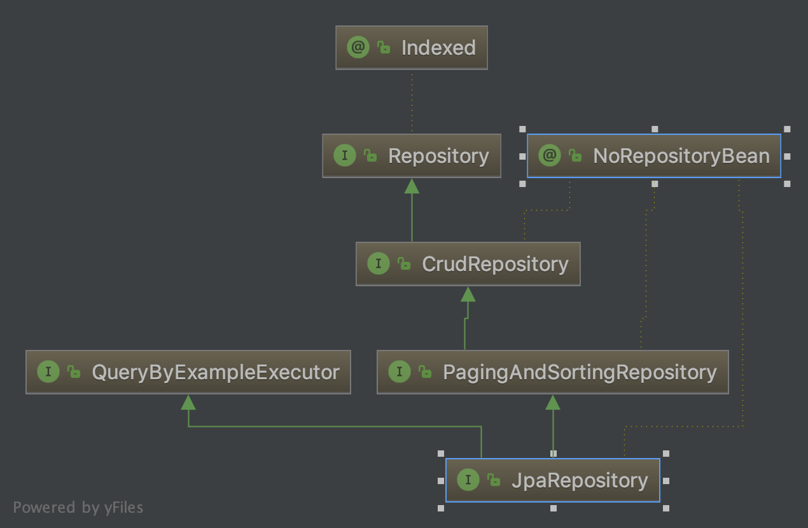

查询方法
查询方法可以由我们声明的命名查询生成，也可以像前面那样由方法名解析。下面是官方文档的例子。方法名称规则如下。如果需要详细说明的话可以查看官方文档Appendix C: Repository query keywords一节。

方法名以find…By, read…By, query…By, count…By和 get…By做开头。在By之前可以添加Distinct表示查找不重复数据。By之后是真正的查询条件。
可以查询某个属性，也可以使用条件进行比较复杂的查询，例如Between, LessThan, GreaterThan, Like，And,Or等。
字符串属性后面可以跟IgnoreCase表示不区分大小写，也可以后跟AllIgnoreCase表示所有属性都不区分大小写。
可以使用OrderBy对结果进行升序或降序排序。
可以查询属性的属性，直接将几个属性连着写即可，如果可能出现歧义属性，可以使用下划线分隔多个属性。
spring-data-jpa所有的语法规定如下图：
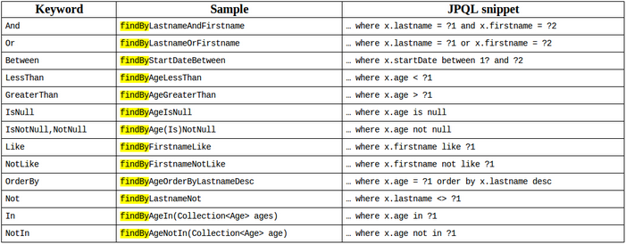

* JPA命名查询
如果查询方法不能完全满足需要，我们可以使用自定义查询来满足需求

```java
@Entity
@NamedQuery(name = "User.findByNickname",
  query = "select u from User u where u.nickname=?1")
public class User {

}
```

之后，在接口中声明对应名称的查询方法。这样我们就可以使用JPQL语法自定义查询方法了。

* 使用Query注解
查询方法和JPQL是对应的，但是却不在同一个地方定义。如果查询方法很多的话，查找和修改就很麻烦。这时候可以改用@Query注解。
该注解还有一个nativeQuery属性，用作直接执行SQL使用。如果我们将该属性指定为true，查询语句也要相应的修改为SQL语句。

```java
public interface UserRepository extends JpaRepository<User, Long> {

  @Query("select u from User u where u.emailAddress = ?1")
  User findByEmailAddress(String emailAddress);
}
```

* Modifying注解
@Modifying注解用来指定某个查询是一个更新操作，这样可以让Spring执行相应的优化。

```java
@Modifying
@Query("update User u set u.firstname = ?1 where u.lastname = ?2")
int setFixedFirstnameFor(String firstname, String lastname);
```

***在一对多中或者多对一中，即便是fetch为eager，也会先查询主对象，再查询关联对象，但是在eager的情况下虽然是有多次查询问题，但是没有n+1问题，关联对象不会像n+1那样多查询n次，而仅仅是把关联对象一次性查询出来，因此，在企业级应用当中，访问量不大的情况下一般来说没什么问题。***

***spring-jpa-hibernate-mysql样例参照chapter5-3***